# 🎟️ Sistema de Cupones y Códigos de Descuento - BullAnalytics

## 📋 Resumen

Este documento complementa la [Guía de Integración PayPal](./paypal_integration_guide.md) y el [Diseño de Base de Datos](./supabase_database_design.md) con un sistema completo de cupones y códigos de descuento.

### Tipos de Cupones Soportados

1. **`free_access`**: Acceso gratuito sin PayPal (como tu ejemplo "xym")
2. **`percentage`**: Descuento porcentual (ej: 50% OFF)
3. **`fixed_amount`**: Descuento fijo en USD (ej: $5 OFF)
4. **`trial_extension`**: Extensión del período de prueba

---

## Implementación en el Backend

### Endpoint: Validar Cupón

```python
from fastapi import APIRouter, HTTPException, Header
from pydantic import BaseModel

router = APIRouter(prefix="/api/coupons", tags=["coupons"])

class ValidateCouponRequest(BaseModel):
    code: str
    plan_name: str  # 'plus' o 'pro'

@router.post("/validate")
async def validate_coupon_endpoint(
    request: ValidateCouponRequest,
    authorization: str = Header(...)
):
    """
    Valida un código de cupón
    """
    try:
        # Autenticar usuario
        user = supabase.auth.get_user(authorization.replace("Bearer ", ""))
        user_id = user.user.id
        
        # Obtener plan_id
        plan_response = supabase.table("subscription_plans") \
            .select("id") \
            .eq("name", request.plan_name) \
            .single() \
            .execute()
        
        if not plan_response.data:
            raise HTTPException(status_code=404, detail="Plan no encontrado")
        
        plan_id = plan_response.data["id"]
        
        # Validar cupón usando función de Supabase
        result = supabase.rpc("validate_coupon", {
            "p_code": request.code,
            "p_user_id": user_id,
            "p_plan_id": plan_id
        }).execute()
        
        validation = result.data
        
        if not validation.get("valid"):
            return {
                "valid": False,
                "error": validation.get("error", "Cupón inválido")
            }
        
        return {
            "valid": True,
            "coupon_type": validation["coupon_type"],
            "discount_amount": validation.get("discount_amount"),
            "discount_percent": validation.get("discount_percent"),
            "duration_months": validation.get("duration_months"),
            "description": validation.get("description")
        }
        
    except Exception as e:
        raise HTTPException(status_code=500, detail=str(e))
```

---

### Endpoint: Crear Suscripción con Cupón

```python
class CreateSubscriptionWithCouponRequest(BaseModel):
    plan_name: str
    coupon_code: str = None  # Opcional

@router.post("/subscriptions/create")
async def create_subscription_with_coupon(
    request: CreateSubscriptionWithCouponRequest,
    authorization: str = Header(...)
):
    """
    Crea una suscripción aplicando un cupón si se proporciona
    """
    try:
        # 1. Autenticar usuario
        user = supabase.auth.get_user(authorization.replace("Bearer ", ""))
        user_id = user.user.id
        user_email = user.user.email
        
        # 2. Obtener plan
        plan_response = supabase.table("subscription_plans") \
            .select("*") \
            .eq("name", request.plan_name) \
            .single() \
            .execute()
        
        if not plan_response.data:
            raise HTTPException(status_code=404, detail="Plan no encontrado")
        
        plan = plan_response.data
        
        # 3. Si hay cupón, validarlo
        coupon_validation = None
        if request.coupon_code:
            validation_result = supabase.rpc("validate_coupon", {
                "p_code": request.coupon_code,
                "p_user_id": user_id,
                "p_plan_id": plan["id"]
            }).execute()
            
            coupon_validation = validation_result.data
            
            if not coupon_validation.get("valid"):
                raise HTTPException(
                    status_code=400,
                    detail=coupon_validation.get("error", "Cupón inválido")
                )
        
        # 4. Determinar si necesita PayPal
        needs_paypal = True
        if coupon_validation and coupon_validation["coupon_type"] == "free_access":
            needs_paypal = False
        
        # 5a. Caso: Acceso Gratuito (sin PayPal)
        if not needs_paypal:
            # Crear suscripción directamente en Supabase
            duration_months = coupon_validation.get("duration_months")
            
            # Calcular fechas
            from datetime import datetime, timedelta
            now = datetime.now()
            
            if duration_months is None:
                # Acceso permanente
                period_end = now + timedelta(days=365 * 100)  # 100 años
            else:
                period_end = now + timedelta(days=30 * duration_months)
            
            # Crear suscripción
            subscription_data = {
                "user_id": user_id,
                "plan_id": plan["id"],
                "status": "active",
                "current_period_start": now.isoformat(),
                "current_period_end": period_end.isoformat(),
                "paypal_subscription_id": None,  # Sin PayPal
            }
            
            sub_response = supabase.table("subscriptions") \
                .insert(subscription_data) \
                .execute()
            
            subscription = sub_response.data[0]
            
            # Aplicar cupón
            apply_result = supabase.rpc("apply_coupon", {
                "p_coupon_code": request.coupon_code,
                "p_user_id": user_id,
                "p_subscription_id": subscription["id"]
            }).execute()
            
            return {
                "success": True,
                "requires_payment": False,
                "subscription": subscription,
                "message": f"¡Cupón aplicado! Tienes acceso gratuito a {plan['display_name']}",
                "coupon_applied": True
            }
        
        # 5b. Caso: Con PayPal (con o sin descuento)
        else:
            access_token = get_paypal_access_token()
            
            # Calcular precio con descuento si aplica
            final_price = float(plan["price"])
            
            if coupon_validation:
                if coupon_validation["coupon_type"] == "percentage":
                    discount_percent = float(coupon_validation["discount_percent"])
                    final_price = final_price * (1 - discount_percent / 100)
                elif coupon_validation["coupon_type"] == "fixed_amount":
                    discount_amount = float(coupon_validation["discount_amount"])
                    final_price = max(0, final_price - discount_amount)
            
            # Si el cupón reduce el precio a $0, tratarlo como free_access
            if final_price == 0:
                # Recursión con lógica de free_access
                return await create_subscription_with_coupon(
                    CreateSubscriptionWithCouponRequest(
                        plan_name=request.plan_name,
                        coupon_code=request.coupon_code
                    ),
                    authorization
                )
            
            # Crear suscripción en PayPal con precio modificado
            # NOTA: PayPal no permite modificar el precio de un plan existente
            # Opción 1: Crear un plan temporal con el precio con descuento
            # Opción 2: Usar PayPal con precio normal y reembolsar después
            # Opción 3: Guardar descuento y aplicarlo manualmente
            
            # Para simplificar, usamos la opción 3:
            # Crear suscripción normal en PayPal y guardar el cupón para referencia
            
            headers = {
                "Authorization": f"Bearer {access_token}",
                "Content-Type": "application/json"
            }
            
            payload = {
                "plan_id": plan["paypal_plan_id"],
                "subscriber": {
                    "email_address": user_email,
                },
                "application_context": {
                    "brand_name": "BullAnalytics",
                    "locale": "es-ES",
                    "shipping_preference": "NO_SHIPPING",
                    "user_action": "SUBSCRIBE_NOW",
                    "return_url": os.getenv("PAYPAL_RETURN_URL"),
                    "cancel_url": os.getenv("PAYPAL_CANCEL_URL")
                }
            }
            
            response = requests.post(
                f"{PAYPAL_BASE_URL}/v1/billing/subscriptions",
                headers=headers,
                json=payload
            )
            
            if response.status_code != 201:
                raise HTTPException(
                    status_code=response.status_code,
                    detail=f"Error en PayPal: {response.json()}"
                )
            
            subscription_data_paypal = response.json()
            paypal_subscription_id = subscription_data_paypal["id"]
            
            # Guardar en Supabase con cupón pendiente
            subscription_data = {
                "user_id": user_id,
                "plan_id": plan["id"],
                "status": "pending_approval",
                "paypal_subscription_id": paypal_subscription_id,
            }
            
            sub_response = supabase.table("subscriptions") \
                .insert(subscription_data) \
                .execute()
            
            subscription = sub_response.data[0]
            
            # Si hay cupón, guardarlo para aplicarlo después de la aprobación
            if coupon_validation:
                # Guardar en metadata o tabla temporal
                supabase.table("pending_coupon_applications").insert({
                    "subscription_id": subscription["id"],
                    "coupon_code": request.coupon_code,
                    "user_id": user_id
                }).execute()
            
            # Obtener approval_url
            approval_url = next(
                link["href"]
                for link in subscription_data_paypal["links"]
                if link["rel"] == "approve"
            )
            
            return {
                "success": True,
                "requires_payment": True,
                "paypal_subscription_id": paypal_subscription_id,
                "approval_url": approval_url,
                "original_price": plan["price"],
                "final_price": final_price,
                "coupon_applied": coupon_validation is not None,
                "discount_info": {
                    "type": coupon_validation["coupon_type"] if coupon_validation else None,
                    "amount": coupon_validation.get("discount_amount") if coupon_validation else None,
                    "percent": coupon_validation.get("discount_percent") if coupon_validation else None
                }
            }
        
    except Exception as e:
        raise HTTPException(status_code=500, detail=str(e))
```

---

## Implementación en el Frontend

### Página de Pricing con Campo de Cupón

```html
<!-- pricing.html -->
<div class="pricing-card">
  <h3>Plan Pro</h3>
  <p id="price-display">$19.99/mes</p>
  
  <!-- Campo de cupón -->
  <div class="coupon-input-group">
    <input 
      type="text" 
      id="coupon-input" 
      placeholder="¿Tienes un código de descuento?"
      class="coupon-input"
    />
    <button onclick="validateCoupon('pro')" class="btn-validate-coupon">
      Aplicar
    </button>
  </div>
  
  <!-- Mensaje de cupón aplicado -->
  <div id="coupon-message" class="hidden"></div>
  
  <button onclick="subscribeToPlan('pro')" class="btn-subscribe">
    Suscribirme
  </button>
</div>

<script>
let appliedCoupon = null;

async function validateCoupon(planName) {
  const couponCode = document.getElementById('coupon-input').value.trim();
  
  if (!couponCode) {
    alert('Por favor ingresa un código de cupón');
    return;
  }
  
  const { data: { session } } = await supabase.auth.getSession();
  
  if (!session) {
    alert('Debes iniciar sesión para validar cupones');
    return;
  }
  
  try {
    const response = await fetch('http://localhost:8080/api/coupons/validate', {
      method: 'POST',
      headers: {
        'Content-Type': 'application/json',
        'Authorization': `Bearer ${session.access_token}`
      },
      body: JSON.stringify({
        code: couponCode,
        plan_name: planName
      })
    });
    
    const data = await response.json();
    
    const messageEl = document.getElementById('coupon-message');
    const priceEl = document.getElementById('price-display');
    
    if (data.valid) {
      appliedCoupon = { code: couponCode, ...data };
      
      // Mostrar mensaje de éxito
      messageEl.classList.remove('hidden');
      messageEl.classList.add('success');
      
      if (data.coupon_type === 'free_access') {
        messageEl.textContent = `✅ ¡Acceso Gratuito! ${data.description}`;
        priceEl.textContent = 'GRATIS';
      } else if (data.coupon_type === 'percentage') {
        messageEl.textContent = `✅ ${data.discount_percent}% de descuento aplicado`;
        const originalPrice = 19.99; // O leer del plan
        const discountedPrice = originalPrice * (1 - data.discount_percent / 100);
        priceEl.innerHTML = `<del>$${originalPrice}</del> $${discountedPrice.toFixed(2)}/mes`;
      } else if (data.coupon_type === 'fixed_amount') {
        messageEl.textContent = `✅ $${data.discount_amount} de descuento aplicado`;
        const originalPrice = 19.99;
        const discountedPrice = Math.max(0, originalPrice - data.discount_amount);
        priceEl.innerHTML = `<del>$${originalPrice}</del> $${discountedPrice.toFixed(2)}/mes`;
      }
      
    } else {
      appliedCoupon = null;
      messageEl.classList.remove('hidden');
      messageEl.classList.add('error');
      messageEl.textContent = `❌ ${data.error}`;
    }
    
  } catch (error) {
    console.error('Error validando cupón:', error);
    alert('Error al validar el cupón');
  }
}

async function subscribeToPlan(planName) {
  const { data: { session } } = await supabase.auth.getSession();
  
  if (!session) {
    alert('Debes iniciar sesión primero');
    window.location.href = '/login';
    return;
  }
  
  try {
    const response = await fetch('http://localhost:8080/api/subscriptions/create', {
      method: 'POST',
      headers: {
        'Content-Type': 'application/json',
        'Authorization': `Bearer ${session.access_token}`
      },
      body: JSON.stringify({
        plan_name: planName,
        coupon_code: appliedCoupon ? appliedCoupon.code : null
      })
    });
    
    const data = await response.json();
    
    if (data.success) {
      if (data.requires_payment) {
        // Redirigir a PayPal
        window.location.href = data.approval_url;
      } else {
        // Acceso gratuito, redirigir a success
        alert(data.message);
        window.location.href = '/dashboard.html';
      }
    } else {
      alert('Error: ' + data.detail);
    }
    
  } catch (error) {
    console.error('Error:', error);
    alert('Error al procesar suscripción');
  }
}
</script>

<style>
.coupon-input-group {
  display: flex;
  gap: 8px;
  margin: 16px 0;
}

.coupon-input {
  flex: 1;
  padding: 12px;
  border: 2px solid #e5e7eb;
  border-radius: 8px;
  font-size: 14px;
}

.btn-validate-coupon {
  padding: 12px 20px;
  background: #10b981;
  color: white;
  border: none;
  border-radius: 8px;
  cursor: pointer;
  font-weight: 600;
}

.btn-validate-coupon:hover {
  background: #059669;
}

#coupon-message {
  padding: 12px;
  border-radius: 8px;
  margin: 12px 0;
  font-size: 14px;
  font-weight: 600;
}

#coupon-message.success {
  background: #d1fae5;
  color: #065f46;
  border: 1px solid #10b981;
}

#coupon-message.error {
  background: #fee2e2;
  color: #991b1b;
  border: 1px solid #ef4444;
}

.hidden {
  display: none;
}
</style>
```

---

## Panel de Administración de Cupones

### Crear Cupón (Admin)

```python
class CreateCouponRequest(BaseModel):
    code: str
    coupon_type: str  # 'free_access', 'percentage', 'fixed_amount', 'trial_extension'
    plan_name: str = None  # Opcional, None = aplica a todos
    discount_amount: float = None
    discount_percent: float = None
    duration_months: int = None  # None = permanente
    max_redemptions: int = None  # None = ilimitado
    restricted_to_email: str = None
    valid_from: str = None
    valid_until: str = None
    description: str = None
    internal_notes: str = None

@router.post("/admin/coupons/create")
async def create_coupon(
    request: CreateCouponRequest,
    authorization: str = Header(...)
):
    """
    ADMIN: Crear un nuevo cupón
    """
    # TODO: Verificar que el usuario es admin
    # Puedes usar custom claims en Supabase Auth
    
    try:
        # Obtener plan_id si se especifica plan
        plan_id = None
        if request.plan_name:
            plan_response = supabase.table("subscription_plans") \
                .select("id") \
                .eq("name", request.plan_name) \
                .single() \
                .execute()
            
            if plan_response.data:
                plan_id = plan_response.data["id"]
        
        # Crear cupón
        coupon_data = {
            "code": request.code.upper(),
            "coupon_type": request.coupon_type,
            "plan_id": plan_id,
            "discount_amount": request.discount_amount,
            "discount_percent": request.discount_percent,
            "duration_months": request.duration_months,
            "max_redemptions": request.max_redemptions,
            "restricted_to_email": request.restricted_to_email,
            "valid_from": request.valid_from or datetime.now().isoformat(),
            "valid_until": request.valid_until,
            "description": request.description,
            "internal_notes": request.internal_notes,
            "is_active": True
        }
        
        result = supabase.table("coupons").insert(coupon_data).execute()
        
        return {
            "success": True,
            "coupon": result.data[0],
            "message": f"Cupón '{request.code}' creado exitosamente"
        }
        
    except Exception as e:
        raise HTTPException(status_code=500, detail=str(e))

@router.get("/admin/coupons")
async def list_coupons(authorization: str = Header(...)):
    """
    ADMIN: Listar todos los cupones
    """
    try:
        result = supabase.table("coupons") \
            .select("*, coupon_redemptions(count)") \
            .order("created_at", desc=True) \
            .execute()
        
        return {
            "coupons": result.data
        }
        
    except Exception as e:
        raise HTTPException(status_code=500, detail=str(e))

@router.delete("/admin/coupons/{coupon_id}")
async def delete_coupon(coupon_id: str, authorization: str = Header(...)):
    """
    ADMIN: Desactivar un cupón
    """
    try:
        supabase.table("coupons") \
            .update({"is_active": False}) \
            .eq("id", coupon_id) \
            .execute()
        
        return {"success": True, "message": "Cupón desactivado"}
        
    except Exception as e:
        raise HTTPException(status_code=500, detail=str(e))
```

---

## Ejemplos de Uso

### 1. Cupón "xym" - Acceso Gratuito Permanente

```sql
INSERT INTO public.coupons (
  code, 
  coupon_type, 
  plan_id, 
  duration_months, 
  max_redemptions, 
  description
) VALUES (
  'xym',
  'free_access',
  (SELECT id FROM public.subscription_plans WHERE name = 'pro'),
  NULL,  -- Permanente
  1,     -- Solo 1 persona
  'Acceso VIP gratuito permanente al Plan Pro'
);
```

### 2. Cupón de Lanzamiento - 50% OFF por 3 meses

```sql
INSERT INTO public.coupons (
  code, 
  coupon_type, 
  plan_id, 
  discount_percent, 
  duration_months, 
  max_redemptions, 
  description
) VALUES (
  'LAUNCH50',
  'percentage',
  (SELECT id FROM public.subscription_plans WHERE name = 'plus'),
  50.00,
  3,
  100,
  '50% de descuento por 3 meses - Campaña de lanzamiento'
);
```

### 3. Cupón de Estudiante - $5 OFF permanente

```sql
INSERT INTO public.coupons (
  code, 
  coupon_type, 
  discount_amount, 
  description
) VALUES (
  'STUDENT5',
  'fixed_amount',
  5.00,
  '$5 de descuento para estudiantes'
);
```

### 4. Cupón Personalizado para un Email Específico

```sql
INSERT INTO public.coupons (
  code, 
  coupon_type, 
  plan_id, 
  duration_months, 
  max_redemptions, 
  restricted_to_email,
  description
) VALUES (
  'FRIEND2025',
  'free_access',
  (SELECT id FROM public.subscription_plans WHERE name = 'plus'),
  6,  -- 6 meses gratis
  1,
  'amigo@example.com',
  'Regalo para amigo - 6 meses gratis Plan Plus'
);
```

---

## Flujo Completo con Cupón "xym"

```mermaid
sequenceDiagram
    actor Usuario
    participant Frontend
    participant Backend
    participant Supabase
    
    Usuario->>Frontend: Ingresa cupón "xym" en Plan Pro
    Frontend->>Backend: POST /api/coupons/validate {code: "xym", plan: "pro"}
    Backend->>Supabase: RPC validate_coupon(...)
    Supabase-->>Backend: {valid: true, type: "free_access"}
    Backend-->>Frontend: Cupón válido - Acceso gratuito
    Frontend->>Usuario: Muestra "GRATIS" en lugar del precio
    
    Usuario->>Frontend: Click "Suscribirme"
    Frontend->>Backend: POST /api/subscriptions/create {plan: "pro", coupon: "xym"}
    Backend->>Supabase: INSERT INTO subscriptions (sin PayPal)
    Backend->>Supabase: RPC apply_coupon(...)
    Supabase->>Supabase: INSERT INTO coupon_redemptions
    Supabase->>Supabase: UPDATE coupons SET times_redeemed++
    Supabase-->>Backend: Suscripción creada
    Backend-->>Frontend: {success: true, requires_payment: false}
    Frontend->>Usuario: Redirige a Dashboard (acceso inmediato)
```



---

## Verificar Cupones desde SQL

```sql
-- Ver todos los cupones activos
SELECT 
  code,
  coupon_type,
  discount_percent,
  discount_amount,
  max_redemptions,
  times_redeemed,
  CASE 
    WHEN max_redemptions IS NULL THEN 'Ilimitado'
    ELSE (max_redemptions - times_redeemed)::TEXT || ' restantes'
  END as disponibilidad,
  description
FROM public.coupons
WHERE is_active = TRUE
ORDER BY created_at DESC;

-- Ver redenciones de un cupón específico
SELECT 
  c.code,
  cr.redeemed_at,
  u.email,
  sp.display_name as plan
FROM public.coupon_redemptions cr
JOIN public.coupons c ON cr.coupon_id = c.id
JOIN auth.users u ON cr.user_id = u.id
LEFT JOIN public.subscriptions s ON cr.subscription_id = s.id
LEFT JOIN public.subscription_plans sp ON s.plan_id = sp.id
WHERE c.code = 'xym'
ORDER BY cr.redeemed_at DESC;
```

---

## Consideraciones Importantes

### 1. Cupones de Acceso Gratuito vs PayPal

- **Acceso Gratuito**: NO requiere PayPal, se crea la suscripción directamente en Supabase
- **Con Descuento**: SÍ requiere PayPal, pero puedes ajustar el precio o reembolsar

### 2. Renovación de Cupones `free_access`

Si el cupón tiene `duration_months = NULL` (permanente), el usuario nunca perderá acceso.
Si tiene duración limitada, al expirar:

```sql
-- Verificar suscripciones que expiran hoy
SELECT * FROM public.subscriptions
WHERE status = 'active'
  AND current_period_end <= NOW()
  AND coupon_id IN (
    SELECT id FROM public.coupons WHERE coupon_type = 'free_access'
  );

-- Desactivarlas automáticamente (ejecutar diariamente con cron job)
UPDATE public.subscriptions
SET status = 'expired'
WHERE current_period_end <= NOW()
  AND status = 'active';
```

### 3. PayPal y Descuentos

PayPal NO permite modificar fácilmente el precio de un plan. Opciones:
- **Opción A**: Crear planes temporales con precio con descuento
- **Opción B**: Cobrar precio normal y reembolsar manualmente
- **Opción C**: Usar PayPal Checkout (pago único) en lugar de Subscriptions

---

**¡El sistema de cupones está listo!** 🎉

Puedes crear cupones como "xym" que dan acceso gratuito sin necesidad de PayPal, o descuentos que se integran con el flujo de PayPal existente.
