# 💳 Guía de Integración PayPal - BullAnalytics

## 📋 Tabla de Contenidos
1. [Resumen de la Integración](#resumen-de-la-integración)
2. [Configuración Inicial de PayPal](#configuración-inicial-de-paypal)
3. [Arquitectura de la Integración](#arquitectura-de-la-integración)
4. [Configuración de Planes en PayPal](#configuración-de-planes-en-paypal)
5. [Implementación en el Backend](#implementación-en-el-backend)
6. [Implementación en el Frontend](#implementación-en-el-frontend)
7. [Webhooks de PayPal](#webhooks-de-paypal)
8. [Integración con Supabase](#integración-con-supabase)
9. [Casos de Uso Completos](#casos-de-uso-completos)
10. [Seguridad y Mejores Prácticas](#seguridad-y-mejores-prácticas)
11. [Testing](#testing)

---

## Resumen de la Integración

### Objetivos
- ✅ Permitir a los usuarios **suscribirse** a planes Plus ($9.99/mes) y Pro ($19.99/mes)
- ✅ Gestionar **renovaciones automáticas** mediante PayPal Subscriptions
- ✅ Procesar **webhooks** para actualizar estado de suscripciones en tiempo real
- ✅ Sincronizar datos entre **PayPal ↔ Supabase**
- ✅ Implementar **cancelaciones y actualizaciones** de planes

### Flujo de Alto Nivel

```mermaid
sequenceDiagram
    actor Usuario
    participant Frontend
    participant Backend
    participant Supabase
    participant PayPal
    
    Usuario->>Frontend: Selecciona Plan Plus
    Frontend->>Backend: POST /api/subscriptions/create
    Backend->>Supabase: Validar usuario autenticado
    Backend->>PayPal: Crear suscripción (Plan ID)
    PayPal-->>Backend: approval_url + subscription_id
    Backend-->>Frontend: Retorna approval_url
    Frontend->>Usuario: Redirige a PayPal checkout
    Usuario->>PayPal: Aprueba suscripción
    PayPal->>Backend: Webhook: BILLING.SUBSCRIPTION.ACTIVATED
    Backend->>Supabase: Crear/actualizar registro subscription
    Backend->>Supabase: Crear registro payment_transaction
    PayPal-->>Usuario: Redirige a success_url
```



---

## Configuración Inicial de PayPal

### 1. Crear Cuenta de PayPal Developer

1. Ir a [PayPal Developer Dashboard](https://developer.paypal.com/dashboard/)
2. Iniciar sesión o crear cuenta
3. Acceder a **Dashboard** → **Apps & Credentials**

### 2. Crear App de PayPal

#### Sandbox (Desarrollo)
```
1. En "Sandbox", click "Create App"
2. Nombre: "BullAnalytics Sandbox"
3. Tipo: "Merchant"
4. Guardar Client ID y Secret
```

#### Live (Producción)
```
1. En "Live", click "Create App"
2. Nombre: "BullAnalytics Production"
3. Completar información de negocio
4. Guardar Client ID y Secret
```

### 3. Variables de Entorno

```bash
# .env
# PayPal Configuration
PAYPAL_MODE=sandbox # 'sandbox' o 'live'
PAYPAL_CLIENT_ID=YOUR_PAYPAL_CLIENT_ID
PAYPAL_CLIENT_SECRET=YOUR_PAYPAL_CLIENT_SECRET

# URLs de redirección
PAYPAL_RETURN_URL=https://bullanalytics.com/subscription/success
PAYPAL_CANCEL_URL=https://bullanalytics.com/pricing

# Webhook
PAYPAL_WEBHOOK_ID=YOUR_WEBHOOK_ID
PAYPAL_WEBHOOK_URL=https://api.bullanalytics.com/webhooks/paypal

# Supabase
SUPABASE_URL=YOUR_SUPABASE_PROJECT_URL
SUPABASE_SERVICE_ROLE_KEY=YOUR_SERVICE_ROLE_KEY
```

---

## Arquitectura de la Integración

### Stack Tecnológico

```
Frontend (HTML/JS)
    ↓
Backend API (FastAPI/Python)
    ↓
PayPal SDK (paypalrestsdk / requests)
    ↓
Supabase SDK (@supabase/supabase-py)
```

### Endpoints Necesarios

| Endpoint | Método | Descripción |
|----------|--------|-------------|
| `/api/subscriptions/plans` | GET | Listar planes disponibles |
| `/api/subscriptions/create` | POST | Crear nueva suscripción PayPal |
| `/api/subscriptions/cancel` | POST | Cancelar suscripción |
| `/api/subscriptions/update` | POST | Cambiar plan |
| `/api/subscriptions/status` | GET | Estado actual del usuario |
| `/webhooks/paypal` | POST | Recibir eventos de PayPal |

---

## Configuración de Planes en PayPal

### Crear Planes de Suscripción en PayPal

#### A través del Dashboard (Recomendado)

1. Ir a **Dashboard** → **Products** → **Subscriptions**
2. Click **Create Plan**
3. Configurar cada plan:

**Plan Plus:**
```
Plan Name: BullAnalytics Plus
Plan ID: (auto-generado, ej: P-XXX123)
Billing Cycle: Monthly
Price: $9.99 USD
Setup Fee: $0.00
```

**Plan Pro:**
```
Plan Name: BullAnalytics Pro
Plan ID: (auto-generado, ej: P-YYY456)
Billing Cycle: Monthly
Price: $24.99 USD
Setup Fee: $0.00
```

4. **Guardar los Plan IDs** y actualizar Supabase:

```sql
UPDATE public.subscription_plans
SET paypal_plan_id = 'P-XXX123'
WHERE name = 'plus';

UPDATE public.subscription_plans
SET paypal_plan_id = 'P-YYY456'
WHERE name = 'pro';
```

#### B través de la API (Programáticamente)

```python
import requests
import base64

def get_paypal_access_token():
    url = "https://api-m.sandbox.paypal.com/v1/oauth2/token"  # sandbox
    # url = "https://api-m.paypal.com/v1/oauth2/token"  # live
    
    auth = base64.b64encode(
        f"{PAYPAL_CLIENT_ID}:{PAYPAL_CLIENT_SECRET}".encode()
    ).decode()
    
    headers = {
        "Authorization": f"Basic {auth}",
        "Content-Type": "application/x-www-form-urlencoded"
    }
    
    data = {"grant_type": "client_credentials"}
    
    response = requests.post(url, headers=headers, data=data)
    return response.json()["access_token"]

def create_paypal_plan(name, description, price):
    access_token = get_paypal_access_token()
    url = "https://api-m.sandbox.paypal.com/v1/billing/plans"
    
    headers = {
        "Authorization": f"Bearer {access_token}",
        "Content-Type": "application/json"
    }
    
    payload = {
        "product_id": "PROD-XXXX",  # Crear producto primero
        "name": name,
        "description": description,
        "billing_cycles": [
            {
                "frequency": {
                    "interval_unit": "MONTH",
                    "interval_count": 1
                },
                "tenure_type": "REGULAR",
                "sequence": 1,
                "total_cycles": 0,  # Infinito
                "pricing_scheme": {
                    "fixed_price": {
                        "value": str(price),
                        "currency_code": "USD"
                    }
                }
            }
        ],
        "payment_preferences": {
            "auto_bill_outstanding": True,
            "payment_failure_threshold": 3
        }
    }
    
    response = requests.post(url, headers=headers, json=payload)
    return response.json()

# Crear planes
plus_plan = create_paypal_plan("BullAnalytics Plus", "Plan Plus mensual", "9.99")
pro_plan = create_paypal_plan("BullAnalytics Pro", "Plan Pro mensual", "24.99")

print(f"Plus Plan ID: {plus_plan['id']}")
print(f"Pro Plan ID: {pro_plan['id']}")
```

---

## Implementación en el Backend

### Dependencias de Python

```bash
pip install paypalrestsdk supabase requests
```

```txt
# requirements.txt
fastapi==0.104.1
uvicorn==0.24.0
paypalrestsdk==1.13.3
supabase==2.3.0
requests==2.31.0
python-dotenv==1.0.0
```

### Configuración de PayPal SDK

```python
# app.py o paypal_config.py
import os
import paypalrestsdk
from dotenv import load_dotenv

load_dotenv()

# Configurar PayPal SDK
paypalrestsdk.configure({
    "mode": os.getenv("PAYPAL_MODE", "sandbox"),  # sandbox o live
    "client_id": os.getenv("PAYPAL_CLIENT_ID"),
    "client_secret": os.getenv("PAYPAL_CLIENT_SECRET")
})

# Para requests directos (alternativa)
PAYPAL_BASE_URL = (
    "https://api-m.sandbox.paypal.com"
    if os.getenv("PAYPAL_MODE") == "sandbox"
    else "https://api-m.paypal.com"
)
```

### Cliente Supabase

```python
from supabase import create_client, Client

supabase: Client = create_client(
    os.getenv("SUPABASE_URL"),
    os.getenv("SUPABASE_SERVICE_ROLE_KEY")  # Importante: usar service role
)
```

### Endpoint: Crear Suscripción

```python
from fastapi import APIRouter, HTTPException, Header
from pydantic import BaseModel
import requests
import base64

router = APIRouter(prefix="/api/subscriptions", tags=["subscriptions"])

class CreateSubscriptionRequest(BaseModel):
    plan_name: str  # 'plus' o 'pro'

@router.post("/create")
async def create_subscription(
    request: CreateSubscriptionRequest,
    authorization: str = Header(...)  # JWT del usuario
):
    """
    Crea una nueva suscripción en PayPal y guarda referencia en Supabase
    """
    try:
        # 1. Autenticar usuario con Supabase
        user = supabase.auth.get_user(authorization.replace("Bearer ", ""))
        user_id = user.user.id
        
        # 2. Obtener plan de Supabase
        plan_response = supabase.table("subscription_plans") \
            .select("*") \
            .eq("name", request.plan_name) \
            .single() \
            .execute()
        
        if not plan_response.data:
            raise HTTPException(status_code=404, detail="Plan no encontrado")
        
        plan = plan_response.data
        paypal_plan_id = plan["paypal_plan_id"]
        
        if not paypal_plan_id:
            raise HTTPException(status_code=400, detail="Plan no configurado en PayPal")
        
        # 3. Crear suscripción en PayPal
        access_token = get_paypal_access_token()
        
        headers = {
            "Authorization": f"Bearer {access_token}",
            "Content-Type": "application/json"
        }
        
        payload = {
            "plan_id": paypal_plan_id,
            "start_time": None,  # Inicia inmediatamente tras aprobación
            "subscriber": {
                "email_address": user.user.email,
            },
            "application_context": {
                "brand_name": "BullAnalytics",
                "locale": "es-ES",
                "shipping_preference": "NO_SHIPPING",
                "user_action": "SUBSCRIBE_NOW",
                "payment_method": {
                    "payer_selected": "PAYPAL",
                    "payee_preferred": "IMMEDIATE_PAYMENT_REQUIRED"
                },
                "return_url": os.getenv("PAYPAL_RETURN_URL"),
                "cancel_url": os.getenv("PAYPAL_CANCEL_URL")
            }
        }
        
        response = requests.post(
            f"{PAYPAL_BASE_URL}/v1/billing/subscriptions",
            headers=headers,
            json=payload
        )
        
        if response.status_code != 201:
            raise HTTPException(
                status_code=response.status_code,
                detail=f"Error en PayPal: {response.json()}"
            )
        
        subscription_data = response.json()
        paypal_subscription_id = subscription_data["id"]
        
        # 4. Guardar referencia en Supabase (status='pending' hasta aprobación)
        supabase.table("subscriptions").insert({
            "user_id": user_id,
            "plan_id": plan["id"],
            "status": "pending_approval",
            "paypal_subscription_id": paypal_subscription_id,
            "current_period_start": None,  # Se actualizará con webhook
            "current_period_end": None
        }).execute()
        
        # 5. Obtener approval_url
        approval_url = next(
            link["href"]
            for link in subscription_data["links"]
            if link["rel"] == "approve"
        )
        
        return {
            "success": True,
            "paypal_subscription_id": paypal_subscription_id,
            "approval_url": approval_url,
            "message": "Redirige al usuario a approval_url para completar el pago"
        }
        
    except Exception as e:
        raise HTTPException(status_code=500, detail=str(e))

def get_paypal_access_token() -> str:
    """Obtiene token de acceso de PayPal"""
    auth = base64.b64encode(
        f"{os.getenv('PAYPAL_CLIENT_ID')}:{os.getenv('PAYPAL_CLIENT_SECRET')}".encode()
    ).decode()
    
    headers = {
        "Authorization": f"Basic {auth}",
        "Content-Type": "application/x-www-form-urlencoded"
    }
    
    response = requests.post(
        f"{PAYPAL_BASE_URL}/v1/oauth2/token",
        headers=headers,
        data={"grant_type": "client_credentials"}
    )
    
    return response.json()["access_token"]
```

### Endpoint: Cancelar Suscripción

```python
@router.post("/cancel")
async def cancel_subscription(authorization: str = Header(...)):
    """
    Cancela la suscripción activa del usuario
    """
    try:
        # 1. Autenticar usuario
        user = supabase.auth.get_user(authorization.replace("Bearer ", ""))
        user_id = user.user.id
        
        # 2. Obtener suscripción activa
        sub_response = supabase.table("subscriptions") \
            .select("*") \
            .eq("user_id", user_id) \
            .eq("status", "active") \
            .single() \
            .execute()
        
        if not sub_response.data:
            raise HTTPException(status_code=404, detail="No tienes una suscripción activa")
        
        subscription = sub_response.data
        paypal_subscription_id = subscription["paypal_subscription_id"]
        
        # 3. Cancelar en PayPal
        access_token = get_paypal_access_token()
        
        headers = {
            "Authorization": f"Bearer {access_token}",
            "Content-Type": "application/json"
        }
        
        payload = {
            "reason": "Usuario solicitó cancelación"
        }
        
        response = requests.post(
            f"{PAYPAL_BASE_URL}/v1/billing/subscriptions/{paypal_subscription_id}/cancel",
            headers=headers,
            json=payload
        )
        
        if response.status_code != 204:
            raise HTTPException(
                status_code=response.status_code,
                detail=f"Error cancelando en PayPal: {response.text}"
            )
        
        # 4. Actualizar en Supabase
        supabase.table("subscriptions").update({
            "status": "canceled",
            "cancel_at_period_end": True,
            "canceled_at": "now()"
        }).eq("id", subscription["id"]).execute()
        
        return {
            "success": True,
            "message": "Suscripción cancelada. Tendrás acceso hasta el final del período actual."
        }
        
    except Exception as e:
        raise HTTPException(status_code=500, detail=str(e))
```

### Endpoint: Obtener Estado de Suscripción

```python
@router.get("/status")
async def get_subscription_status(authorization: str = Header(...)):
    """
    Retorna el estado actual de la suscripción del usuario
    """
    try:
        user = supabase.auth.get_user(authorization.replace("Bearer ", ""))
        user_id = user.user.id
        
        # Obtener suscripción activa con join a plan
        response = supabase.table("subscriptions") \
            .select("*, subscription_plans(*)") \
            .eq("user_id", user_id) \
            .order("created_at", desc=True) \
            .limit(1) \
            .execute()
        
        if not response.data:
            # Usuario sin suscripción = plan free
            free_plan = supabase.table("subscription_plans") \
                .select("*") \
                .eq("name", "free") \
                .single() \
                .execute()
            
            return {
                "has_subscription": False,
                "plan": free_plan.data,
                "status": "free"
            }
        
        subscription = response.data[0]
        
        return {
            "has_subscription": True,
            "subscription": subscription,
            "plan": subscription["subscription_plans"],
            "status": subscription["status"]
        }
        
    except Exception as e:
        raise HTTPException(status_code=500, detail=str(e))
```

---

## Implementación en el Frontend

### 1. Página de Pricing con PayPal

```html
<!-- pricing.html -->
<div class="pricing-card">
  <h3>Plan Plus</h3>
  <p>$9.99/mes</p>
  <button onclick="subscribeToPlan('plus')" class="btn-subscribe">
    Suscribirme
  </button>
</div>

<script>
async function subscribeToPlan(planName) {
  try {
    // Obtener token de autenticación de Supabase
    const { data: { session } } = await supabase.auth.getSession();
    
    if (!session) {
      alert('Debes iniciar sesión primero');
      window.location.href = '/login';
      return;
    }
    
    // Llamar a backend para crear suscripción
    const response = await fetch('http://localhost:8080/api/subscriptions/create', {
      method: 'POST',
      headers: {
        'Content-Type': 'application/json',
        'Authorization': `Bearer ${session.access_token}`
      },
      body: JSON.stringify({ plan_name: planName })
    });
    
    const data = await response.json();
    
    if (data.success) {
      // Redirigir a PayPal para aprobar suscripción
      window.location.href = data.approval_url;
    } else {
      alert('Error al crear suscripción: ' + data.detail);
    }
  } catch (error) {
    console.error('Error:', error);
    alert('Error al procesar suscripción');
  }
}
</script>
```

### 2. Página de Éxito

```html
<!-- subscription-success.html -->
<!DOCTYPE html>
<html>
<head>
  <title>Suscripción Exitosa - BullAnalytics</title>
</head>
<body>
  <div class="success-container">
    <h1>✅ ¡Suscripción Exitosa!</h1>
    <p>Tu suscripción ha sido activada.</p>
    <p>En unos momentos podrás acceder a todas las funciones premium.</p>
    <button onclick="window.location.href='/dashboard.html'">
      Ir al Dashboard
    </button>
  </div>

  <script>
    // Opcional: verificar estado de suscripción
    setTimeout(async () => {
      const { data: { session } } = await supabase.auth.getSession();
      
      const response = await fetch('http://localhost:8080/api/subscriptions/status', {
        headers: {
          'Authorization': `Bearer ${session.access_token}`
        }
      });
      
      const status = await response.json();
      console.log('Estado de suscripción:', status);
    }, 2000);
  </script>
</body>
</html>
```

### 3. Panel de Cuenta con Cancelación

```javascript
// account.html - agregar funcionalidad de cancelar
async function cancelSubscription() {
  if (!confirm('¿Estás seguro de que deseas cancelar tu suscripción?')) {
    return;
  }
  
  const { data: { session } } = await supabase.auth.getSession();
  
  const response = await fetch('http://localhost:8080/api/subscriptions/cancel', {
    method: 'POST',
    headers: {
      'Authorization': `Bearer ${session.access_token}`
    }
  });
  
  const data = await response.json();
  
  if (data.success) {
    alert(data.message);
    location.reload();
  } else {
    alert('Error al cancelar: ' + data.detail);
  }
}
```

---

## Webhooks de PayPal

### ¿Por qué son necesarios los webhooks?

Los webhooks permiten recibir notificaciones en tiempo real de PayPal cuando ocurren eventos como:
- ✅ Suscripción activada
- 💰 Pago exitoso
- ❌ Pago fallido
- 🚫 Suscripción cancelada
- 🔄 Suscripción actualizada

### Configurar Webhook en PayPal Dashboard

1. Ir a **Dashboard** → **Apps & Credentials**
2. Seleccionar tu app
3. Scroll down a **Webhooks**
4. Click **Add Webhook**
5. Configurar:
   - **Webhook URL**: `https://api.bullanalytics.com/webhooks/paypal`
   - **Event types**: Seleccionar todos los eventos de `BILLING.SUBSCRIPTION.*` y `PAYMENT.*`

### Implementar Endpoint de Webhook

```python
from fastapi import APIRouter, Request, HTTPException
import hashlib
import hmac
import json
from datetime import datetime, timedelta

webhook_router = APIRouter(prefix="/webhooks", tags=["webhooks"])

@webhook_router.post("/paypal")
async def paypal_webhook(request: Request):
    """
    Recibe y procesa webhooks de PayPal
    """
    try:
        # 1. Leer body del webhook
        body = await request.body()
        headers = request.headers
        
        # 2. Verificar firma (IMPORTANTE para seguridad)
        if not verify_paypal_webhook(headers, body):
            raise HTTPException(status_code=401, detail="Firma inválida")
        
        # 3. Parsear evento
        event = json.loads(body)
        event_type = event.get("event_type")
        resource = event.get("resource", {})
        
        print(f"📩 Webhook recibido: {event_type}")
        
        # 4. Procesar según tipo de evento
        if event_type == "BILLING.SUBSCRIPTION.ACTIVATED":
            await handle_subscription_activated(resource)
        
        elif event_type == "BILLING.SUBSCRIPTION.CANCELLED":
            await handle_subscription_cancelled(resource)
        
        elif event_type == "PAYMENT.SALE.COMPLETED":
            await handle_payment_completed(resource)
        
        elif event_type == "PAYMENT.SALE.DENIED":
            await handle_payment_failed(resource)
        
        elif event_type == "BILLING.SUBSCRIPTION.UPDATED":
            await handle_subscription_updated(resource)
        
        return {"status": "success"}
        
    except Exception as e:
        print(f"❌ Error procesando webhook: {e}")
        # Retornar 200 para no reintentos innecesarios
        return {"status": "error", "message": str(e)}

def verify_paypal_webhook(headers, body) -> bool:
    """
    Verifica la firma del webhook de PayPal
    """
    # Obtener headers necesarios
    transmission_id = headers.get("paypal-transmission-id")
    timestamp = headers.get("paypal-transmission-time")
    webhook_id = os.getenv("PAYPAL_WEBHOOK_ID")
    signature = headers.get("paypal-transmission-sig")
    cert_url = headers.get("paypal-cert-url")
    auth_algo = headers.get("paypal-auth-algo")
    
    # Construir mensaje esperado
    expected_sig_string = f"{transmission_id}|{timestamp}|{webhook_id}|{hashlib.sha256(body).hexdigest()}"
    
    # Verificar usando API de PayPal (recomendado)
    access_token = get_paypal_access_token()
    
    verify_payload = {
        "transmission_id": transmission_id,
        "transmission_time": timestamp,
        "cert_url": cert_url,
        "auth_algo": auth_algo,
        "transmission_sig": signature,
        "webhook_id": webhook_id,
        "webhook_event": json.loads(body)
    }
    
    response = requests.post(
        f"{PAYPAL_BASE_URL}/v1/notifications/verify-webhook-signature",
        headers={
            "Authorization": f"Bearer {access_token}",
            "Content-Type": "application/json"
        },
        json=verify_payload
    )
    
    verification = response.json()
    return verification.get("verification_status") == "SUCCESS"

async def handle_subscription_activated(resource):
    """
    Maneja activación de suscripción
    """
    paypal_subscription_id = resource.get("id")
    billing_info = resource.get("billing_info", {})
    
    # Obtener fechas de período
    last_payment = billing_info.get("last_payment", {})
    next_billing_time = resource.get("billing_info", {}).get("next_billing_time")
    
    # Actualizar en Supabase
    supabase.table("subscriptions").update({
        "status": "active",
        "current_period_start": last_payment.get("time"),
        "current_period_end": next_billing_time
    }).eq("paypal_subscription_id", paypal_subscription_id).execute()
    
    print(f"✅ Suscripción activada: {paypal_subscription_id}")

async def handle_subscription_cancelled(resource):
    """
    Maneja cancelación de suscripción
    """
    paypal_subscription_id = resource.get("id")
    
    supabase.table("subscriptions").update({
        "status": "canceled",
        "canceled_at": datetime.now().isoformat()
    }).eq("paypal_subscription_id", paypal_subscription_id).execute()
    
    print(f"🚫 Suscripción cancelada: {paypal_subscription_id}")

async def handle_payment_completed(resource):
    """
    Maneja pago exitoso
    """
    # Obtener información del pago
    sale_id = resource.get("id")
    amount = resource.get("amount", {})
    billing_agreement_id = resource.get("billing_agreement_id")
    
    # Buscar suscripción
    sub_response = supabase.table("subscriptions") \
        .select("*") \
        .eq("paypal_subscription_id", billing_agreement_id) \
        .single() \
        .execute()
    
    if sub_response.data:
        subscription = sub_response.data
        
        # Registrar transacción
        supabase.table("payment_transactions").insert({
            "user_id": subscription["user_id"],
            "subscription_id": subscription["id"],
            "paypal_payment_id": sale_id,
            "amount": float(amount.get("total", 0)),
            "currency": amount.get("currency", "USD"),
            "status": "completed",
            "paypal_response": resource
        }).execute()
        
        # Actualizar período de suscripción
        new_period_end = datetime.now() + timedelta(days=30)
        supabase.table("subscriptions").update({
            "current_period_start": datetime.now().isoformat(),
            "current_period_end": new_period_end.isoformat()
        }).eq("id", subscription["id"]).execute()
        
        print(f"💰 Pago completado: ${amount.get('total')} para suscripción {billing_agreement_id}")

async def handle_payment_failed(resource):
    """
    Maneja pago fallido
    """
    billing_agreement_id = resource.get("billing_agreement_id")
    
    # Marcar suscripción como past_due
    supabase.table("subscriptions").update({
        "status": "past_due"
    }).eq("paypal_subscription_id", billing_agreement_id).execute()
    
    print(f"❌ Pago fallido para suscripción {billing_agreement_id}")

async def handle_subscription_updated(resource):
    """
    Maneja actualización de suscripción
    """
    paypal_subscription_id = resource.get("id")
    plan_id = resource.get("plan_id")
    
    # Actualizar plan en Supabase
    plan_response = supabase.table("subscription_plans") \
        .select("id") \
        .eq("paypal_plan_id", plan_id) \
        .single() \
        .execute()
    
    if plan_response.data:
        supabase.table("subscriptions").update({
            "plan_id": plan_response.data["id"]
        }).eq("paypal_subscription_id", paypal_subscription_id).execute()
        
        print(f"🔄 Suscripción actualizada: {paypal_subscription_id}")
```

---

## Integración con Supabase

### Funciones Edge para Validación de Plan

```sql
-- Función para verificar si usuario tiene acceso a feature
CREATE OR REPLACE FUNCTION user_has_feature(
  p_user_id UUID,
  p_feature_key TEXT
)
RETURNS BOOLEAN AS $$
DECLARE
  v_features JSONB;
  v_feature_value TEXT;
BEGIN
  -- Obtener features del plan activo
  SELECT sp.features INTO v_features
  FROM public.subscriptions s
  JOIN public.subscription_plans sp ON s.plan_id = sp.id
  WHERE s.user_id = p_user_id
    AND s.status = 'active'
  LIMIT 1;
  
  -- Si no hay suscripción, usar plan free
  IF v_features IS NULL THEN
    SELECT features INTO v_features
    FROM public.subscription_plans
    WHERE name = 'free';
  END IF;
  
  -- Obtener valor del feature
  v_feature_value := v_features ->> p_feature_key;
  
  -- Interpretación según tipo
  IF v_feature_value = 'true' THEN
    RETURN TRUE;
  ELSIF v_feature_value = 'false' THEN
    RETURN FALSE;
  ELSIF v_feature_value IS NOT NULL AND v_feature_value != '' THEN
    RETURN TRUE;  -- Cualquier valor no vacío = feature habilitado
  ELSE
    RETURN FALSE;
  END IF;
END;
$$ LANGUAGE plpgsql SECURITY DEFINER;

-- Ejemplo de uso
-- SELECT user_has_feature('uuid-del-usuario', 'telegram_alerts');
```

### Middleware de Validación en Backend

```python
from functools import wraps

def require_feature(feature_key: str):
    """
    Decorator para endpoints que requieren un feature específico
    """
    def decorator(func):
        @wraps(func)
        async def wrapper(*args, authorization: str = None, **kwargs):
            # Extraer user_id del token
            user = supabase.auth.get_user(authorization.replace("Bearer ", ""))
            user_id = user.user.id
            
            # Verificar feature
            result = supabase.rpc("user_has_feature", {
                "p_user_id": user_id,
                "p_feature_key": feature_key
            }).execute()
            
            if not result.data:
                raise HTTPException(
                    status_code=403,
                    detail=f"Tu plan no incluye esta funcionalidad. Actualiza tu suscripción."
                )
            
            return await func(*args, authorization=authorization, **kwargs)
        return wrapper
    return decorator

# Uso
@app.post("/api/rules/telegram")
@require_feature("telegram_alerts")
async def send_telegram_alert(authorization: str = Header(...)):
    # Solo usuarios con plan Plus o Pro pueden acceder
    pass
```

---

## Casos de Uso Completos

### 1. Usuario se Suscribe a Plan Plus

```
1. Usuario en pricing.html click "Suscribirme" en Plan Plus
2. Frontend llama POST /api/subscriptions/create con plan_name='plus'
3. Backend:
   a. Verifica autenticación
   b. Obtiene paypal_plan_id de 'plus' desde Supabase
   c. Crea suscripción en PayPal
   d. Guarda registro con status='pending_approval'
   e. Retorna approval_url
4. Frontend redirige a PayPal
5. Usuario aprueba en PayPal
6. PayPal envía webhook BILLING.SUBSCRIPTION.ACTIVATED
7. Backend webhook:
   a. Verifica firma
   b. Actualiza status='active' en Supabase
   c. Guarda fechas de período
8. PayPal redirige a success_url
9. Usuario ve confirmación
```

### 2. Pago Mensual Automático

```
1. Llega fecha de renovación (30 días después)
2. PayPal procesa pago automáticamente
3. PayPal envía webhook PAYMENT.SALE.COMPLETED
4. Backend webhook:
   a. Registra transacción en payment_transactions
   b. Actualiza current_period_start y current_period_end
   c. Mantiene status='active'
```

### 3. Usuario Cancela Suscripción

```
1. Usuario en account.html click "Cancelar Suscripción"
2. Frontend llama POST /api/subscriptions/cancel
3. Backend:
   a. Verifica autenticación
   b. Llama API de PayPal para cancelar
   c. Actualiza status='canceled' y cancel_at_period_end=true
4. Usuario mantiene acceso hasta fin del período
5. Al llegar current_period_end, features se desactivan automáticamente
```

### 4. Cambio de Plan (Plus → Pro)

```
1. Usuario click "Actualizar a Pro"
2. Frontend llama POST /api/subscriptions/update con new_plan='pro'
3. Backend:
   a. Obtiene paypal_plan_id de 'pro'
   b. Llama PayPal API para actualizar plan
   c. PayPal calcula prorrateoreembolso/cargo
4. PayPal envía webhook BILLING.SUBSCRIPTION.UPDATED
5. Backend actualiza plan_id en Supabase
6. Usuario tiene acceso inmediato a features de Pro
```

---

## Seguridad y Mejores Prácticas

### 1. Protección de Credenciales

```bash
# ❌ NUNCA exponer en frontend
const PAYPAL_CLIENT_SECRET = "xxx"; // MAL

# ✅ Solo en backend
PAYPAL_CLIENT_SECRET=your_secret  # .env
```

### 2. Validación de Webhooks

> [!WARNING]
> **SIEMPRE verifica la firma del webhook**. Sin esto, cualquiera puede enviar webhooks falsos.

```python
# ✅ CORRECTO
if not verify_paypal_webhook(headers, body):
    raise HTTPException(status_code=401, detail="Firma inválida")

# ❌ INCORRECTO - Nunca confíes sin verificar
event = json.loads(body)  # Vulnerable a ataques
```

### 3. Uso de Service Role Key

```python
# Para webhooks y operaciones del sistema
supabase = create_client(
    SUPABASE_URL,
    SUPABASE_SERVICE_ROLE_KEY  # ✅ Bypasses RLS
)

# Para operaciones de usuario
supabase = create_client(
    SUPABASE_URL,
    user_access_token  # ✅ Respeta RLS
)
```

### 4. Manejo de Errores

```python
try:
    # Crear suscripción
    response = create_paypal_subscription()
except PayPalError as e:
    # Log error pero no exponer detalles al usuario
    logger.error(f"PayPal error: {e}")
    raise HTTPException(
        status_code=500,
        detail="Error procesando pago. Por favor intenta de nuevo."
    )
```

### 5. Idempotencia en Webhooks

```python
# Evitar procesar el mismo webhook múltiples veces
async def handle_subscription_activated(resource):
    paypal_subscription_id = resource.get("id")
    
    # Verificar si ya fue procesado
    existing = supabase.table("subscriptions") \
        .select("status") \
        .eq("paypal_subscription_id", paypal_subscription_id) \
        .single() \
        .execute()
    
    if existing.data and existing.data["status"] == "active":
        print("⚠️ Webhook ya procesado, omitiendo...")
        return
    
    # Procesar...
```

---

## Testing

### 1. Testing en Sandbox de PayPal

PayPal proporciona cuentas de prueba:

1. Ir a **Dashboard** → **Sandbox** → **Accounts**
2. Usar cuenta **Business** para recibir pagos
3. Usar cuenta **Personal** para hacer pagos

**Credenciales de Prueba (ejemplo):**
```
Email: sb-test123@personal.example.com
Password: 12345678
```

### 2. Testing de Webhooks con ngrok

```bash
# 1. Instalar ngrok
npm install -g ngrok

# 2. Exponer puerto local
ngrok http 8080

# 3. Copiar URL (ej: https://abc123.ngrok.io)
# 4. Configurar en PayPal Webhook URL: https://abc123.ngrok.io/webhooks/paypal
```

### 3. Simular Webhooks Manualmente

```bash
# Usar PayPal Webhook Simulator en Dashboard
# O enviar POST directamente:

curl -X POST http://localhost:8080/webhooks/paypal \
  -H "Content-Type: application/json" \
  -d '{
    "event_type": "BILLING.SUBSCRIPTION.ACTIVATED",
    "resource": {
      "id": "I-TEST123",
      "billing_info": {
        "next_billing_time": "2025-12-30T00:00:00Z"
      }
    }
  }'
```

### 4. Test Cases Críticos

```python
import pytest

def test_create_subscription_success():
    # Arrange
    user_token = "valid_token"
    plan_name = "plus"
    
    # Act
    response = client.post(
        "/api/subscriptions/create",
        json={"plan_name": plan_name},
        headers={"Authorization": f"Bearer {user_token}"}
    )
    
    # Assert
    assert response.status_code == 200
    assert "approval_url" in response.json()

def test create_subscription_invalid_plan():
    response = client.post(
        "/api/subscriptions/create",
        json={"plan_name": "invalid"},
        headers={"Authorization": "Bearer token"}
    )
    
    assert response.status_code == 404

def test_webhook_signature_invalid():
    response = client.post(
        "/webhooks/paypal",
        json={"event_type": "TEST"},
        headers={"paypal-transmission-sig": "invalid"}
    )
    
    assert response.status_code == 401
```

---

## Checklist de Implementación

### Fase 1: Configuración Inicial
- [ ] Crear cuenta PayPal Developer
- [ ] Crear app en Sandbox
- [ ] Configurar variables de entorno
- [ ] Crear planes en PayPal
- [ ] Actualizar `subscription_plans` en Supabase con `paypal_plan_id`

### Fase 2: Backend
- [ ] Instalar dependencias (paypalrestsdk, supabase)
- [ ] Implementar `get_paypal_access_token()`
- [ ] Crear endpoint `/api/subscriptions/create`
- [ ] Crear endpoint `/api/subscriptions/cancel`
- [ ] Crear endpoint `/api/subscriptions/status`
- [ ] Implementar webhook `/webhooks/paypal`
- [ ] Configurar verificación de firma
- [ ] Implementar handlers para eventos

### Fase 3: Frontend
- [ ] Agregar botones "Suscribirme" en pricing
- [ ] Implementar `subscribeToPlan()`
- [ ] Crear página de éxito
- [ ] Agregar botón de cancelación en account
- [ ] Mostrar estado de suscripción actual

### Fase 4: Testing
- [ ] Probar flujo completo en Sandbox
- [ ] Verificar webhooks con ngrok
- [ ] Probar cancelación
- [ ] Probar cambio de plan
- [ ] Simular pago fallido

### Fase 5: Producción
- [ ] Crear app en Live (PayPal)
- [ ] Actualizar variables de entorno para producción
- [ ] Configurar webhook en producción
- [ ] Verificar certificados SSL
- [ ] Monitorear logs de webhooks

---

## Recursos Adicionales

- [PayPal Subscriptions API Docs](https://developer.paypal.com/docs/api/subscriptions/v1/)
- [PayPal Webhooks Guide](https://developer.paypal.com/api/rest/webhooks/)
- [Supabase Auth Docs](https://supabase.com/docs/guides/auth)
- [FastAPI Docs](https://fastapi.tiangolo.com/)

---

**Documento creado**: Noviembre 2025  
**Versión**: 1.0  
**Autor**: BullAnalytics Team
