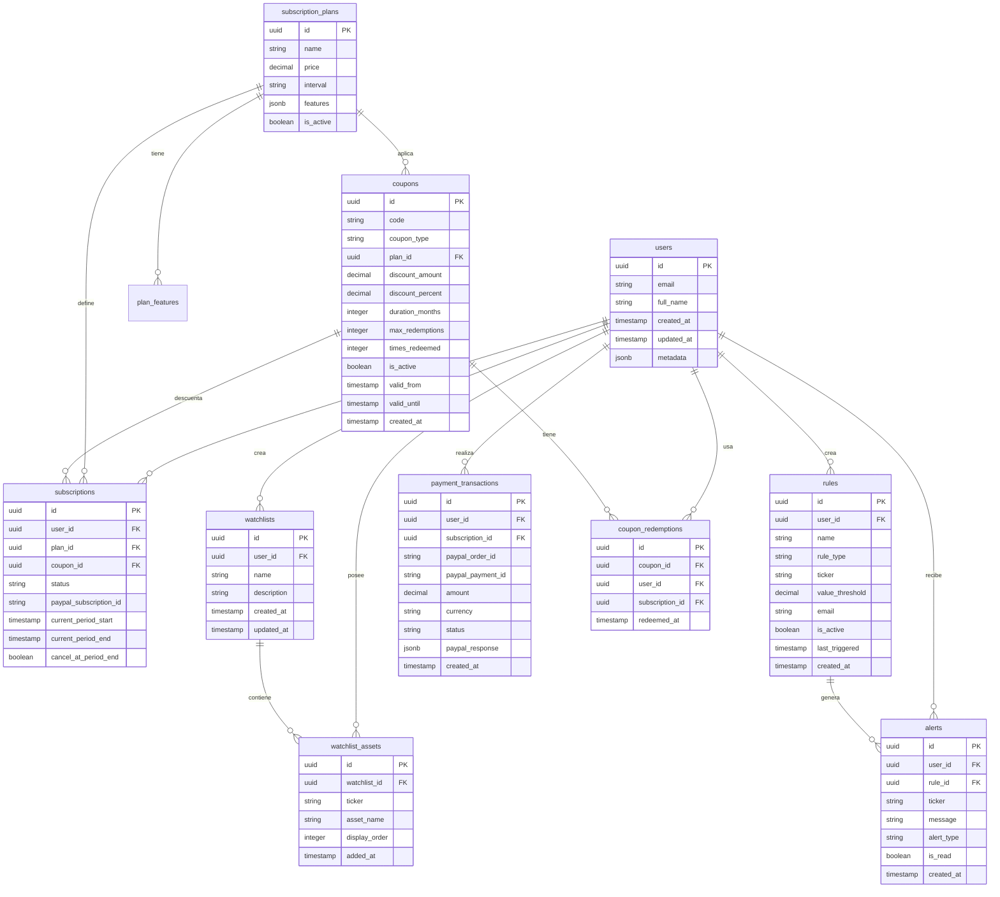

# 🗄️ Diseño de Base de Datos Supabase - BullAnalytics

## 📋 Tabla de Contenidos
1. [Resumen Ejecutivo](#resumen-ejecutivo)
2. [Diagrama Entidad-Relación](#diagrama-entidad-relación)
3. [Esquema de Tablas](#esquema-de-tablas)
4. [Políticas de Seguridad (RLS)](#políticas-de-seguridad-rls)
5. [Índices y Optimizaciones](#índices-y-optimizaciones)
6. [Migración desde JSON](#migración-desde-json)
7. [Script SQL Completo](#script-sql-completo)

---

## Resumen Ejecutivo

Este documento define la arquitectura de base de datos para **BullAnalytics**, una aplicación SaaS de análisis financiero con:
- ✅ Autenticación de usuarios mediante Supabase Auth
- ✅ 3 planes de suscripción: **Free**, **Plus** ($9.99/mes), **Pro** ($19.99/mes)
- ✅ Sistema de alertas personalizadas por activos financieros
- ✅ Watchlists personalizadas por usuario
- ✅ Gestión completa de suscripciones y pagos

### Características Clave del Diseño
- **Multi-tenant**: Separación completa de datos por usuario usando RLS
- **Limites por plan**: Control de features basado en el plan de suscripción
- **Auditoría**: Timestamps en todas las tablas
- **Performance**: Índices optimizados para consultas frecuentes
- **Seguridad**: Row Level Security en todas las tablas

---

## Diagrama Entidad-Relación



---

## Esquema de Tablas

### 1. `users` (Extendiendo Supabase Auth)

> [!NOTE]
> Supabase Auth ya provee la tabla `auth.users`. Esta tabla extiende la funcionalidad con datos adicionales del perfil.

```sql
-- Tabla de extensión para perfiles de usuario
CREATE TABLE public.user_profiles (
  id UUID PRIMARY KEY REFERENCES auth.users(id) ON DELETE CASCADE,
  email TEXT NOT NULL,
  full_name TEXT,
  avatar_url TEXT,
  phone TEXT,
  
  -- Metadatos adicionales
  preferences JSONB DEFAULT '{}',
  onboarding_completed BOOLEAN DEFAULT FALSE,
  
  -- Timestamps
  created_at TIMESTAMPTZ DEFAULT NOW(),
  updated_at TIMESTAMPTZ DEFAULT NOW(),
  
  UNIQUE(email)
);

-- Índices
CREATE INDEX idx_user_profiles_email ON public.user_profiles(email);
CREATE INDEX idx_user_profiles_created_at ON public.user_profiles(created_at DESC);

-- Trigger para actualizar updated_at
CREATE OR REPLACE FUNCTION update_updated_at_column()
RETURNS TRIGGER AS $$
BEGIN
  NEW.updated_at = NOW();
  RETURN NEW;
END;
$$ LANGUAGE plpgsql;

CREATE TRIGGER update_user_profiles_updated_at
  BEFORE UPDATE ON public.user_profiles
  FOR EACH ROW
  EXECUTE FUNCTION update_updated_at_column();
```

---

### 2. `subscription_plans` - Planes de Suscripción

```sql
CREATE TABLE public.subscription_plans (
  id UUID PRIMARY KEY DEFAULT gen_random_uuid(),
  
  -- Información del plan
  name TEXT NOT NULL UNIQUE, -- 'Free', 'Plus', 'Pro'
  display_name TEXT NOT NULL, -- 'Plan Básico', 'Plan Plus', 'Plan Pro'
  description TEXT,
  
  -- Pricing
  price DECIMAL(10,2) NOT NULL DEFAULT 0.00,
  currency TEXT NOT NULL DEFAULT 'USD',
  billing_interval TEXT NOT NULL DEFAULT 'month', -- 'month', 'year'
  
  -- PayPal Integration
  paypal_plan_id TEXT UNIQUE, -- ID del plan en PayPal
  
  -- Features (JSONB para flexibilidad)
  features JSONB NOT NULL DEFAULT '{
    "max_rules": 3,
    "max_watchlist_assets": 10,
    "email_alerts": true,
    "telegram_alerts": false,
    "ai_assistant": false,
    "technical_indicators": 0,
    "personalized_summaries": "general",
    "broker_integration": false,
    "priority_support": false
  }',
  
  -- Control
  is_active BOOLEAN DEFAULT TRUE,
  sort_order INTEGER DEFAULT 0,
  
  -- Timestamps
  created_at TIMESTAMPTZ DEFAULT NOW(),
  updated_at TIMESTAMPTZ DEFAULT NOW()
);

-- Índices
CREATE INDEX idx_subscription_plans_name ON public.subscription_plans(name);
CREATE INDEX idx_subscription_plans_active ON public.subscription_plans(is_active);

-- Trigger updated_at
CREATE TRIGGER update_subscription_plans_updated_at
  BEFORE UPDATE ON public.subscription_plans
  FOR EACH ROW
  EXECUTE FUNCTION update_updated_at_column();

-- Datos iniciales
INSERT INTO public.subscription_plans (name, display_name, description, price, paypal_plan_id, features, sort_order) VALUES
('free', 'Plan Básico', 'Dashboard básico con funcionalidades esenciales', 0.00, NULL, '{
  "max_rules": 3,
  "max_watchlist_assets": 10,
  "email_alerts": true,
  "telegram_alerts": false,
  "ai_assistant": false,
  "technical_indicators": 0,
  "personalized_summaries": "general",
  "broker_integration": false,
  "priority_support": false
}', 1),

('plus', 'Plan Plus', 'Seguimiento ilimitado con indicadores técnicos avanzados', 9.99, NULL, '{
  "max_rules": 8,
  "max_watchlist_assets": -1,
  "email_alerts": true,
  "telegram_alerts": true,
  "ai_assistant": "rules_only",
  "technical_indicators": 25,
  "personalized_summaries": "personalized",
  "broker_integration": false,
  "priority_support": false
}', 2),

('pro', 'Plan Pro', 'Acceso completo con IA personalizada y soporte prioritario', 19.99, NULL, '{
  "max_rules": -1,
  "max_watchlist_assets": -1,
  "email_alerts": true,
  "telegram_alerts": true,
  "ai_assistant": "full",
  "technical_indicators": 25,
  "personalized_summaries": "daily_weekly",
  "broker_integration": true,
  "priority_support": true
}', 3);
```

> [!IMPORTANT]
> **Nota sobre features**: `-1` significa "ilimitado" en `max_rules` y `max_watchlist_assets`.

---

### 3. `subscriptions` - Suscripciones de Usuario

```sql
CREATE TABLE public.subscriptions (
  id UUID PRIMARY KEY DEFAULT gen_random_uuid(),
  
  -- Relaciones
  user_id UUID NOT NULL REFERENCES auth.users(id) ON DELETE CASCADE,
  plan_id UUID NOT NULL REFERENCES public.subscription_plans(id),
  
  -- Estado de la suscripción
  status TEXT NOT NULL DEFAULT 'active', -- 'active', 'canceled', 'past_due', 'paused', 'expired'
  
  -- Integración PayPal
  paypal_subscription_id TEXT UNIQUE, -- ID de suscripción en PayPal
  
  -- Período de facturación
  current_period_start TIMESTAMPTZ NOT NULL DEFAULT NOW(),
  current_period_end TIMESTAMPTZ NOT NULL DEFAULT NOW() + INTERVAL '1 month',
  
  -- Control de cancelación
  cancel_at_period_end BOOLEAN DEFAULT FALSE,
  canceled_at TIMESTAMPTZ,
  
  -- Trial (si aplica)
  trial_start TIMESTAMPTZ,
  trial_end TIMESTAMPTZ,
  
  -- Timestamps
  created_at TIMESTAMPTZ DEFAULT NOW(),
  updated_at TIMESTAMPTZ DEFAULT NOW(),
  
  -- Constraint: un usuario solo puede tener una suscripción activa
  UNIQUE(user_id, status) WHERE status = 'active'
);

-- Índices
CREATE INDEX idx_subscriptions_user_id ON public.subscriptions(user_id);
CREATE INDEX idx_subscriptions_status ON public.subscriptions(status);
CREATE INDEX idx_subscriptions_paypal ON public.subscriptions(paypal_subscription_id);
CREATE INDEX idx_subscriptions_period_end ON public.subscriptions(current_period_end);

-- Trigger updated_at
CREATE TRIGGER update_subscriptions_updated_at
  BEFORE UPDATE ON public.subscriptions
  FOR EACH ROW
  EXECUTE FUNCTION update_updated_at_column();
```

---

### 4. `rules` - Reglas de Alertas

```sql
CREATE TABLE public.rules (
  id UUID PRIMARY KEY DEFAULT gen_random_uuid(),
  
  -- Relaciones
  user_id UUID NOT NULL REFERENCES auth.users(id) ON DELETE CASCADE,
  
  -- Información de la regla
  name TEXT NOT NULL,
  rule_type TEXT NOT NULL, -- 'price_below', 'price_above', 'pe_below', 'pe_above', 'max_distance'
  
  -- Asset y valor
  ticker TEXT NOT NULL,
  value_threshold DECIMAL(20,4) NOT NULL,
  
  -- Notificación
  email TEXT NOT NULL,
  
  -- Estado
  is_active BOOLEAN DEFAULT TRUE,
  last_triggered TIMESTAMPTZ,
  
  -- Timestamps
  created_at TIMESTAMPTZ DEFAULT NOW(),
  updated_at TIMESTAMPTZ DEFAULT NOW(),
  
  -- Validaciones
  CHECK (rule_type IN ('price_below', 'price_above', 'pe_below', 'pe_above', 'max_distance'))
);

-- Índices
CREATE INDEX idx_rules_user_id ON public.rules(user_id);
CREATE INDEX idx_rules_ticker ON public.rules(ticker);
CREATE INDEX idx_rules_active ON public.rules(is_active) WHERE is_active = TRUE;
CREATE INDEX idx_rules_last_triggered ON public.rules(last_triggered);
CREATE INDEX idx_rules_created_at ON public.rules(created_at DESC);

-- Trigger updated_at
CREATE TRIGGER update_rules_updated_at
  BEFORE UPDATE ON public.rules
  FOR EACH ROW
  EXECUTE FUNCTION update_updated_at_column();
```

---

### 5. `watchlists` - Listas de Seguimiento

```sql
CREATE TABLE public.watchlists (
  id UUID PRIMARY KEY DEFAULT gen_random_uuid(),
  
  -- Relaciones
  user_id UUID NOT NULL REFERENCES auth.users(id) ON DELETE CASCADE,
  
  -- Información de la watchlist
  name TEXT NOT NULL,
  description TEXT,
  
  -- Timestamps
  created_at TIMESTAMPTZ DEFAULT NOW(),
  updated_at TIMESTAMPTZ DEFAULT NOW(),
  
  -- Un usuario no puede tener dos watchlists con el mismo nombre
  UNIQUE(user_id, name)
);

-- Índices
CREATE INDEX idx_watchlists_user_id ON public.watchlists(user_id);
CREATE INDEX idx_watchlists_name ON public.watchlists(name);

-- Trigger updated_at
CREATE TRIGGER update_watchlists_updated_at
  BEFORE UPDATE ON public.watchlists
  FOR EACH ROW
  EXECUTE FUNCTION update_updated_at_column();
```

---

### 6. `watchlist_assets` - Activos en Watchlists

```sql
CREATE TABLE public.watchlist_assets (
  id UUID PRIMARY KEY DEFAULT gen_random_uuid(),
  
  -- Relaciones
  watchlist_id UUID NOT NULL REFERENCES public.watchlists(id) ON DELETE CASCADE,
  
  -- Asset info
  ticker TEXT NOT NULL,
  asset_name TEXT NOT NULL,
  
  -- Ordenamiento
  display_order INTEGER DEFAULT 0,
  
  -- Timestamp
  added_at TIMESTAMPTZ DEFAULT NOW(),
  
  -- Un ticker no puede estar duplicado en la misma watchlist
  UNIQUE(watchlist_id, ticker)
);

-- Índices
CREATE INDEX idx_watchlist_assets_watchlist_id ON public.watchlist_assets(watchlist_id);
CREATE INDEX idx_watchlist_assets_ticker ON public.watchlist_assets(ticker);
CREATE INDEX idx_watchlist_assets_order ON public.watchlist_assets(watchlist_id, display_order);

-- Función para contar activos por usuario (validar límites del plan)
CREATE OR REPLACE FUNCTION count_user_watchlist_assets(p_user_id UUID)
RETURNS INTEGER AS $$
DECLARE
  asset_count INTEGER;
BEGIN
  SELECT COUNT(DISTINCT wa.id)
  INTO asset_count
  FROM public.watchlist_assets wa
  JOIN public.watchlists w ON wa.watchlist_id = w.id
  WHERE w.user_id = p_user_id;
  
  RETURN asset_count;
END;
$$ LANGUAGE plpgsql SECURITY DEFINER;
```

---

### 7. `alerts` - Historial de Alertas Generadas

```sql
CREATE TABLE public.alerts (
  id UUID PRIMARY KEY DEFAULT gen_random_uuid(),
  
  -- Relaciones
  user_id UUID NOT NULL REFERENCES auth.users(id) ON DELETE CASCADE,
  rule_id UUID REFERENCES public.rules(id) ON DELETE SET NULL,
  
  -- Información de la alerta
  ticker TEXT NOT NULL,
  message TEXT NOT NULL,
  alert_type TEXT NOT NULL, -- mismo que rule_type
  
  -- Estado
  is_read BOOLEAN DEFAULT FALSE,
  read_at TIMESTAMPTZ,
  
  -- Timestamp
  created_at TIMESTAMPTZ DEFAULT NOW()
);

-- Índices
CREATE INDEX idx_alerts_user_id ON public.alerts(user_id);
CREATE INDEX idx_alerts_rule_id ON public.alerts(rule_id);
CREATE INDEX idx_alerts_unread ON public.alerts(user_id, is_read) WHERE is_read = FALSE;
CREATE INDEX idx_alerts_created_at ON public.alerts(created_at DESC);

-- Función para marcar como leída
CREATE OR REPLACE FUNCTION mark_alert_read(p_alert_id UUID)
RETURNS VOID AS $$
BEGIN
  UPDATE public.alerts
  SET is_read = TRUE, read_at = NOW()
  WHERE id = p_alert_id;
END;
$$ LANGUAGE plpgsql SECURITY DEFINER;
```

---

### 8. `payment_transactions` - Transacciones de Pago

```sql
CREATE TABLE public.payment_transactions (
  id UUID PRIMARY KEY DEFAULT gen_random_uuid(),
  
  -- Relaciones
  user_id UUID NOT NULL REFERENCES auth.users(id) ON DELETE CASCADE,
  subscription_id UUID REFERENCES public.subscriptions(id) ON DELETE SET NULL,
  
  -- PayPal IDs
  paypal_order_id TEXT,
  paypal_payment_id TEXT,
  paypal_payer_id TEXT,
  
  -- Monto
  amount DECIMAL(10,2) NOT NULL,
  currency TEXT NOT NULL DEFAULT 'USD',
  
  -- Estado
  status TEXT NOT NULL DEFAULT 'pending', -- 'pending', 'completed', 'failed', 'refunded'
  
  -- Metadata de PayPal (almacenar webhook completo)
  paypal_response JSONB,
  
  -- Timestamps
  created_at TIMESTAMPTZ DEFAULT NOW(),
  updated_at TIMESTAMPTZ DEFAULT NOW()
);

-- Índices
CREATE INDEX idx_payment_transactions_user_id ON public.payment_transactions(user_id);
CREATE INDEX idx_payment_transactions_subscription_id ON public.payment_transactions(subscription_id);
CREATE INDEX idx_payment_transactions_paypal_order ON public.payment_transactions(paypal_order_id);
CREATE INDEX idx_payment_transactions_status ON public.payment_transactions(status);
CREATE INDEX idx_payment_transactions_created_at ON public.payment_transactions(created_at DESC);

-- Trigger updated_at
CREATE TRIGGER update_payment_transactions_updated_at
  BEFORE UPDATE ON public.payment_transactions
  FOR EACH ROW
  EXECUTE FUNCTION update_updated_at_column();
```

---

### 9. `coupons` - Códigos de Descuento y Cupones

```sql
CREATE TABLE public.coupons (
  id UUID PRIMARY KEY DEFAULT gen_random_uuid(),
  
  -- Código del cupón
  code TEXT NOT NULL UNIQUE,
  
  -- Tipo de cupón
  coupon_type TEXT NOT NULL, -- 'free_access', 'percentage', 'fixed_amount', 'trial_extension'
  
  -- Plan aplicable (NULL = aplica a cualquier plan)
  plan_id UUID REFERENCES public.subscription_plans(id) ON DELETE SET NULL,
  
  -- Descuentos
  discount_amount DECIMAL(10,2), -- Descuento fijo en USD (ej: $5.00)
  discount_percent DECIMAL(5,2), -- Descuento porcentual (ej: 25.00 = 25%)
  
  -- Duración del descuento/acceso gratuito
  duration_months INTEGER, -- NULL = permanente, N = N meses
  
  -- Límites de uso
  max_redemptions INTEGER, -- NULL = ilimitado
  times_redeemed INTEGER DEFAULT 0,
  
  -- Usuario específico (para cupones personalizados)
  restricted_to_email TEXT,
  
  -- Estado
  is_active BOOLEAN DEFAULT TRUE,
  
  -- Validez temporal
  valid_from TIMESTAMPTZ DEFAULT NOW(),
  valid_until TIMESTAMPTZ, -- NULL = sin fecha límite
  
  -- Metadata adicional
  description TEXT,
  internal_notes TEXT, -- Notas para admins
  
  -- Timestamps
  created_at TIMESTAMPTZ DEFAULT NOW(),
  updated_at TIMESTAMPTZ DEFAULT NOW(),
  
  -- Validaciones
  CHECK (coupon_type IN ('free_access', 'percentage', 'fixed_amount', 'trial_extension')),
  CHECK (
    (coupon_type = 'percentage' AND discount_percent IS NOT NULL AND discount_percent > 0 AND discount_percent <= 100) OR
    (coupon_type = 'fixed_amount' AND discount_amount IS NOT NULL AND discount_amount > 0) OR
    (coupon_type IN ('free_access', 'trial_extension'))
  )
);

-- Índices
CREATE INDEX idx_coupons_code ON public.coupons(UPPER(code)); -- Case-insensitive
CREATE INDEX idx_coupons_active ON public.coupons(is_active) WHERE is_active = TRUE;
CREATE INDEX idx_coupons_valid ON public.coupons(valid_from, valid_until);
CREATE INDEX idx_coupons_plan ON public.coupons(plan_id);

-- Trigger updated_at
CREATE TRIGGER update_coupons_updated_at
  BEFORE UPDATE ON public.coupons
  FOR EACH ROW
  EXECUTE FUNCTION update_updated_at_column();

-- Ejemplos de cupones
INSERT INTO public.coupons (code, coupon_type, plan_id, duration_months, max_redemptions, description, internal_notes) VALUES
-- Cupón "xym": Acceso gratuito permanente al Plan Pro
('xym', 'free_access', 
  (SELECT id FROM public.subscription_plans WHERE name = 'pro'), 
  NULL, -- Permanente
  1, -- Solo 1 persona
  'Acceso gratuito permanente al Plan Pro',
  'Cupón especial para usuario VIP'),

-- Cupón de descuento 50% por 3 meses en Plan Plus
('LAUNCH50', 'percentage',
  (SELECT id FROM public.subscription_plans WHERE name = 'plus'),
  3, -- 3 meses
  100, -- Primeros 100 usuarios
  '50% de descuento por 3 meses en Plan Plus',
  'Campaña de lanzamiento'),

-- Cupón de $5 de descuento permanente
('SAVE5', 'fixed_amount',
  NULL, -- Aplica a cualquier plan
  NULL, -- Permanente
  NULL, -- Ilimitado
  '$5 de descuento en cualquier plan',
  'Cupón genérico de descuento'),

-- Trial extendido de 30 días
('TRIAL30', 'trial_extension',
  NULL,
  1, -- 1 mes extra
  500,
  'Extiende tu trial por 30 días adicionales',
  'Campaña de prueba extendida');
```

> [!IMPORTANT]
> **Tipos de cupones:**
> - `free_access`: Acceso gratuito sin PayPal (como "xym")
> - `percentage`: Descuento porcentual
> - `fixed_amount`: Descuento fijo en USD
> - `trial_extension`: Extensión del período de prueba

---

### 10. `coupon_redemptions` - Historial de Redenciones

```sql
CREATE TABLE public.coupon_redemptions (
  id UUID PRIMARY KEY DEFAULT gen_random_uuid(),
  
  -- Relaciones
  coupon_id UUID NOT NULL REFERENCES public.coupons(id) ON DELETE CASCADE,
  user_id UUID NOT NULL REFERENCES auth.users(id) ON DELETE CASCADE,
  subscription_id UUID REFERENCES public.subscriptions(id) ON DELETE SET NULL,
  
  -- Timestamp
  redeemed_at TIMESTAMPTZ DEFAULT NOW(),
  
  -- Constraint: un usuario solo puede usar el mismo cupón una vez
  UNIQUE(coupon_id, user_id)
);

-- Índices
CREATE INDEX idx_coupon_redemptions_coupon ON public.coupon_redemptions(coupon_id);
CREATE INDEX idx_coupon_redemptions_user ON public.coupon_redemptions(user_id);
CREATE INDEX idx_coupon_redemptions_date ON public.coupon_redemptions(redeemed_at DESC);
```

---

### Actualizar tabla `subscriptions` para cupones

```sql
-- Agregar columna coupon_id a subscriptions
ALTER TABLE public.subscriptions
ADD COLUMN coupon_id UUID REFERENCES public.coupons(id) ON DELETE SET NULL;

CREATE INDEX idx_subscriptions_coupon ON public.subscriptions(coupon_id);
```

---

### Funciones de Validación de Cupones

```sql
-- Función para validar un cupón
CREATE OR REPLACE FUNCTION validate_coupon(
  p_code TEXT,
  p_user_id UUID,
  p_plan_id UUID
)
RETURNS JSONB AS $$
DECLARE
  v_coupon RECORD;
  v_redemptions INTEGER;
  v_user_has_used BOOLEAN;
BEGIN
  -- Obtener cupón (case-insensitive)
  SELECT * INTO v_coupon
  FROM public.coupons
  WHERE UPPER(code) = UPPER(p_code)
    AND is_active = TRUE;
  
  -- Validar existencia
  IF NOT FOUND THEN
    RETURN jsonb_build_object(
      'valid', FALSE,
      'error', 'Cupón no encontrado o inactivo'
    );
  END IF;
  
  -- Validar fechas
  IF v_coupon.valid_from > NOW() THEN
    RETURN jsonb_build_object(
      'valid', FALSE,
      'error', 'Este cupón aún no es válido'
    );
  END IF;
  
  IF v_coupon.valid_until IS NOT NULL AND v_coupon.valid_until < NOW() THEN
    RETURN jsonb_build_object(
      'valid', FALSE,
      'error', 'Este cupón ha expirado'
    );
  END IF;
  
  -- Validar límite de usos
  IF v_coupon.max_redemptions IS NOT NULL 
     AND v_coupon.times_redeemed >= v_coupon.max_redemptions THEN
    RETURN jsonb_build_object(
      'valid', FALSE,
      'error', 'Este cupón ha alcanzado su límite de usos'
    );
  END IF;
  
  -- Validar restricción de email
  IF v_coupon.restricted_to_email IS NOT NULL THEN
    DECLARE
      v_user_email TEXT;
    BEGIN
      SELECT email INTO v_user_email
      FROM auth.users
      WHERE id = p_user_id;
      
      IF LOWER(v_user_email) != LOWER(v_coupon.restricted_to_email) THEN
        RETURN jsonb_build_object(
          'valid', FALSE,
          'error', 'Este cupón no está disponible para tu cuenta'
        );
      END IF;
    END;
  END IF;
  
  -- Validar plan aplicable
  IF v_coupon.plan_id IS NOT NULL AND v_coupon.plan_id != p_plan_id THEN
    RETURN jsonb_build_object(
      'valid', FALSE,
      'error', 'Este cupón no es válido para el plan seleccionado'
    );
  END IF;
  
  -- Validar si el usuario ya lo usó
  SELECT EXISTS(
    SELECT 1 FROM public.coupon_redemptions
    WHERE coupon_id = v_coupon.id AND user_id = p_user_id
  ) INTO v_user_has_used;
  
  IF v_user_has_used THEN
    RETURN jsonb_build_object(
      'valid', FALSE,
      'error', 'Ya has usado este cupón anteriormente'
    );
  END IF;
  
  -- Cupón válido, retornar detalles
  RETURN jsonb_build_object(
    'valid', TRUE,
    'coupon_id', v_coupon.id,
    'coupon_type', v_coupon.coupon_type,
    'discount_amount', v_coupon.discount_amount,
    'discount_percent', v_coupon.discount_percent,
    'duration_months', v_coupon.duration_months,
    'plan_id', v_coupon.plan_id,
    'description', v_coupon.description
  );
END;
$$ LANGUAGE plpgsql SECURITY DEFINER;

-- Función para aplicar cupón
CREATE OR REPLACE FUNCTION apply_coupon(
  p_coupon_code TEXT,
  p_user_id UUID,
  p_subscription_id UUID
)
RETURNS JSONB AS $$
DECLARE
  v_coupon_id UUID;
  v_validation JSONB;
  v_subscription RECORD;
BEGIN
  -- Obtener suscripción
  SELECT * INTO v_subscription
  FROM public.subscriptions
  WHERE id = p_subscription_id AND user_id = p_user_id;
  
  IF NOT FOUND THEN
    RETURN jsonb_build_object(
      'success', FALSE,
      'error', 'Suscripción no encontrada'
    );
  END IF;
  
  -- Validar cupón
  v_validation := validate_coupon(
    p_coupon_code,
    p_user_id,
    v_subscription.plan_id
  );
  
  IF NOT (v_validation->>'valid')::BOOLEAN THEN
    RETURN jsonb_build_object(
      'success', FALSE,
      'error', v_validation->>'error'
    );
  END IF;
  
  v_coupon_id := (v_validation->>'coupon_id')::UUID;
  
  -- Registrar redención
  INSERT INTO public.coupon_redemptions (coupon_id, user_id, subscription_id)
  VALUES (v_coupon_id, p_user_id, p_subscription_id);
  
  -- Incrementar contador
  UPDATE public.coupons
  SET times_redeemed = times_redeemed + 1
  WHERE id = v_coupon_id;
  
  -- Actualizar suscripción
  UPDATE public.subscriptions
  SET coupon_id = v_coupon_id
  WHERE id = p_subscription_id;
  
  RETURN jsonb_build_object(
    'success', TRUE,
    'message', 'Cupón aplicado exitosamente',
    'coupon_details', v_validation
  );
END;
$$ LANGUAGE plpgsql SECURITY DEFINER;
```

---

## Políticas de Seguridad (RLS)

> [!WARNING]
> **Row Level Security (RLS)** es CRÍTICO para la seguridad multi-tenant. Cada política asegura que los usuarios solo accedan a SUS datos.

### Habilitar RLS en todas las tablas

```sql
-- Habilitar RLS
ALTER TABLE public.user_profiles ENABLE ROW LEVEL SECURITY;
ALTER TABLE public.subscription_plans ENABLE ROW LEVEL SECURITY;
ALTER TABLE public.subscriptions ENABLE ROW LEVEL SECURITY;
ALTER TABLE public.rules ENABLE ROW LEVEL SECURITY;
ALTER TABLE public.watchlists ENABLE ROW LEVEL SECURITY;
ALTER TABLE public.watchlist_assets ENABLE ROW LEVEL SECURITY;
ALTER TABLE public.alerts ENABLE ROW LEVEL SECURITY;
ALTER TABLE public.payment_transactions ENABLE ROW LEVEL SECURITY;
```

### Políticas para `user_profiles`

```sql
-- Los usuarios solo pueden ver y editar su propio perfil
CREATE POLICY "Users can view own profile"
  ON public.user_profiles FOR SELECT
  USING (auth.uid() = id);

CREATE POLICY "Users can update own profile"
  ON public.user_profiles FOR UPDATE
  USING (auth.uid() = id);

CREATE POLICY "Users can insert own profile"
  ON public.user_profiles FOR INSERT
  WITH CHECK (auth.uid() = id);
```

### Políticas para `subscription_plans`

```sql
-- Todos pueden ver los planes (público)
CREATE POLICY "Anyone can view subscription plans"
  ON public.subscription_plans FOR SELECT
  USING (is_active = TRUE);

-- Solo admins pueden modificar (implementar con custom claims)
CREATE POLICY "Only admins can modify plans"
  ON public.subscription_plans FOR ALL
  USING (
    auth.jwt() ->> 'role' = 'admin'
  );
```

### Políticas para `subscriptions`

```sql
-- Los usuarios solo pueden ver sus propias suscripciones
CREATE POLICY "Users can view own subscriptions"
  ON public.subscriptions FOR SELECT
  USING (auth.uid() = user_id);

CREATE POLICY "Users can insert own subscriptions"
  ON public.subscriptions FOR INSERT
  WITH CHECK (auth.uid() = user_id);

CREATE POLICY "Users can update own subscriptions"
  ON public.subscriptions FOR UPDATE
  USING (auth.uid() = user_id);
```

### Políticas para `rules`

```sql
-- Los usuarios solo pueden gestionar sus propias reglas
CREATE POLICY "Users can view own rules"
  ON public.rules FOR SELECT
  USING (auth.uid() = user_id);

CREATE POLICY "Users can insert own rules"
  ON public.rules FOR INSERT
  WITH CHECK (auth.uid() = user_id);

CREATE POLICY "Users can update own rules"
  ON public.rules FOR UPDATE
  USING (auth.uid() = user_id);

CREATE POLICY "Users can delete own rules"
  ON public.rules FOR DELETE
  USING (auth.uid() = user_id);
```

### Políticas para `watchlists`

```sql
CREATE POLICY "Users can view own watchlists"
  ON public.watchlists FOR SELECT
  USING (auth.uid() = user_id);

CREATE POLICY "Users can insert own watchlists"
  ON public.watchlists FOR INSERT
  WITH CHECK (auth.uid() = user_id);

CREATE POLICY "Users can update own watchlists"
  ON public.watchlists FOR UPDATE
  USING (auth.uid() = user_id);

CREATE POLICY "Users can delete own watchlists"
  ON public.watchlists FOR DELETE
  USING (auth.uid() = user_id);
```

### Políticas para `watchlist_assets`

```sql
-- Los usuarios pueden gestionar activos de SUS watchlists
CREATE POLICY "Users can view own watchlist assets"
  ON public.watchlist_assets FOR SELECT
  USING (
    watchlist_id IN (
      SELECT id FROM public.watchlists WHERE user_id = auth.uid()
    )
  );

CREATE POLICY "Users can insert into own watchlists"
  ON public.watchlist_assets FOR INSERT
  WITH CHECK (
    watchlist_id IN (
      SELECT id FROM public.watchlists WHERE user_id = auth.uid()
    )
  );

CREATE POLICY "Users can update own watchlist assets"
  ON public.watchlist_assets FOR UPDATE
  USING (
    watchlist_id IN (
      SELECT id FROM public.watchlists WHERE user_id = auth.uid()
    )
  );

CREATE POLICY "Users can delete own watchlist assets"
  ON public.watchlist_assets FOR DELETE
  USING (
    watchlist_id IN (
      SELECT id FROM public.watchlists WHERE user_id = auth.uid()
    )
  );
```

### Políticas para `alerts`

```sql
CREATE POLICY "Users can view own alerts"
  ON public.alerts FOR SELECT
  USING (auth.uid() = user_id);

CREATE POLICY "Users can update own alerts"
  ON public.alerts FOR UPDATE
  USING (auth.uid() = user_id);

-- Sistema puede insertar alertas (usar service role key)
CREATE POLICY "Service can insert alerts"
  ON public.alerts FOR INSERT
  WITH CHECK (TRUE);

### Funciones Helper para Validación de Límites

```sql
-- Función para verificar límites del plan
CREATE OR REPLACE FUNCTION check_user_plan_limit(
  p_user_id UUID,
  p_limit_type TEXT -- 'max_rules' | 'max_watchlist_assets'
)
RETURNS BOOLEAN AS $$
DECLARE
  v_current_count INTEGER;
  v_max_allowed INTEGER;
  v_plan_features JSONB;
BEGIN
  -- Obtener features del plan actual
  SELECT sp.features INTO v_plan_features
  FROM public.subscriptions s
  JOIN public.subscription_plans sp ON s.plan_id = sp.id
  WHERE s.user_id = p_user_id
    AND s.status = 'active'
  LIMIT 1;
  
  -- Si no hay suscripción activa, usar plan free
  IF v_plan_features IS NULL THEN
    SELECT features INTO v_plan_features
    FROM public.subscription_plans
    WHERE name = 'free';
  END IF;
  
  -- Obtener límite del plan
  v_max_allowed := (v_plan_features ->> p_limit_type)::INTEGER;
  
  -- -1 significa ilimitado
  IF v_max_allowed = -1 THEN
    RETURN TRUE;
  END IF;
  
  -- Contar recursos actuales
  IF p_limit_type = 'max_rules' THEN
    SELECT COUNT(*) INTO v_current_count
    FROM public.rules
    WHERE user_id = p_user_id AND is_active = TRUE;
  ELSIF p_limit_type = 'max_watchlist_assets' THEN
    SELECT COUNT(*) INTO v_current_count
    FROM public.watchlist_assets wa
    JOIN public.watchlists w ON wa.watchlist_id = w.id
    WHERE w.user_id = p_user_id;
  END IF;
  
  RETURN v_current_count < v_max_allowed;
END;
$$ LANGUAGE plpgsql SECURITY DEFINER;

-- Trigger para validar límites al crear regla
CREATE OR REPLACE FUNCTION validate_rule_limit()
RETURNS TRIGGER AS $$
BEGIN
  IF NOT check_user_plan_limit(NEW.user_id, 'max_rules') THEN
    RAISE EXCEPTION 'Has alcanzado el límite de reglas de tu plan. Actualiza tu suscripción.';
  END IF;
  RETURN NEW;
END;
$$ LANGUAGE plpgsql;

CREATE TRIGGER check_rule_limit_before_insert
  BEFORE INSERT ON public.rules
  FOR EACH ROW
  EXECUTE FUNCTION validate_rule_limit();

-- Trigger para validar límites al agregar activo a watchlist
CREATE OR REPLACE FUNCTION validate_watchlist_asset_limit()
RETURNS TRIGGER AS $$
DECLARE
  v_user_id UUID;
BEGIN
  -- Obtener user_id de la watchlist
  SELECT user_id INTO v_user_id
  FROM public.watchlists
  WHERE id = NEW.watchlist_id;
  
  IF NOT check_user_plan_limit(v_user_id, 'max_watchlist_assets') THEN
    RAISE EXCEPTION 'Has alcanzado el límite de activos en watchlists de tu plan. Actualiza tu suscripción.';
  END IF;
  RETURN NEW;
END;
$$ LANGUAGE plpgsql;

CREATE TRIGGER check_watchlist_asset_limit_before_insert
  BEFORE INSERT ON public.watchlist_assets
  FOR EACH ROW
  EXECUTE FUNCTION validate_watchlist_asset_limit();
```

### Vista Consolidada: Usuario con Suscripción Activa

```sql
CREATE OR REPLACE VIEW user_subscription_details AS
SELECT 
  u.id AS user_id,
  u.email,
  u.full_name,
  sp.name AS plan_name,
  sp.display_name AS plan_display_name,
  sp.price AS plan_price,
  sp.features AS plan_features,
  s.status AS subscription_status,
  s.current_period_start,
  s.current_period_end,
  s.cancel_at_period_end,
  s.paypal_subscription_id
FROM auth.users u
LEFT JOIN public.user_profiles up ON u.id = up.id
LEFT JOIN public.subscriptions s ON u.id = s.user_id AND s.status = 'active'
LEFT JOIN public.subscription_plans sp ON s.plan_id = sp.id;
```

---

## Migración desde JSON

### Script de Migración para `rules.json`

```sql
-- Función para migrar reglas desde JSON existente
-- NOTA: Ejecutar desde el backend con los datos del JSON
CREATE OR REPLACE FUNCTION migrate_rules_from_json(
  p_user_id UUID,
  p_rules_json JSONB
)
RETURNS INTEGER AS $$
DECLARE
  v_rule JSONB;
  v_count INTEGER := 0;
BEGIN
  FOR v_rule IN SELECT * FROM jsonb_array_elements(p_rules_json)
  LOOP
    INSERT INTO public.rules (
      user_id,
      name,
      rule_type,
      ticker,
      value_threshold,
      email,
      is_active,
      created_at,
      last_triggered
    ) VALUES (
      p_user_id,
      v_rule->>'name',
      v_rule->>'type',
      v_rule->>'ticker',
      (v_rule->>'value')::DECIMAL,
      v_rule->>'email',
      TRUE,
      (v_rule->>'created_at')::TIMESTAMPTZ,
      (v_rule->>'last_triggered')::TIMESTAMPTZ
    );
    v_count := v_count + 1;
  END LOOP;
  
  RETURN v_count;
END;
$$ LANGUAGE plpgsql SECURITY DEFINER;
```

### Script de Migración para `watchlists.json`

```sql
-- Función para migrar watchlists desde JSON existente
CREATE OR REPLACE FUNCTION migrate_watchlists_from_json(
  p_user_id UUID,
  p_watchlists_json JSONB
)
RETURNS INTEGER AS $$
DECLARE
  v_watchlist_name TEXT;
  v_watchlist_id UUID;
  v_assets JSONB;
  v_ticker TEXT;
  v_asset_name TEXT;
  v_count INTEGER := 0;
BEGIN
  -- Iterar sobre cada watchlist en el JSON
  FOR v_watchlist_name IN SELECT jsonb_object_keys(p_watchlists_json)
  LOOP
    -- Crear watchlist
    INSERT INTO public.watchlists (user_id, name)
    VALUES (p_user_id, v_watchlist_name)
    RETURNING id INTO v_watchlist_id;
    
    -- Obtener activos de esta watchlist
    v_assets := p_watchlists_json->v_watchlist_name;
    
    -- Iterar sobre cada activo
    FOR v_ticker IN SELECT jsonb_object_keys(v_assets)
    LOOP
      v_asset_name := v_assets->>v_ticker;
      
      INSERT INTO public.watchlist_assets (
        watchlist_id,
        ticker,
        asset_name,
        display_order
      ) VALUES (
        v_watchlist_id,
        v_ticker,
        v_asset_name,
        v_count
      );
      
      v_count := v_count + 1;
    END LOOP;
  END LOOP;
  
  RETURN v_count;
END;
$$ LANGUAGE plpgsql SECURITY DEFINER;
```

### Ejemplo de Uso de Migración (desde Backend)

```javascript
// Ejemplo en JavaScript (Node.js/TypeScript)
const { createClient } = require('@supabase/supabase-js');

async function migrateUserData(userId, rulesJson, watchlistsJson) {
  const supabase = createClient(
    process.env.SUPABASE_URL,
    process.env.SUPABASE_SERVICE_ROLE_KEY // ¡Usar service role!
  );

  // Migrar reglas
  const { data: rulesResult, error: rulesError } = await supabase
    .rpc('migrate_rules_from_json', {
      p_user_id: userId,
      p_rules_json: rulesJson
    });

  if (rulesError) console.error('Error migrando reglas:', rulesError);
  else console.log(`✅ Migradas ${rulesResult} reglas`);

  // Migrar watchlists
  const { data: watchlistsResult, error: watchlistsError } = await supabase
    .rpc('migrate_watchlists_from_json', {
      p_user_id: userId,
      p_watchlists_json: watchlistsJson
    });

  if (watchlistsError) console.error('Error migrando watchlists:', watchlistsError);
  else console.log(`✅ Migrados ${watchlistsResult} activos en watchlists`);
}
```

---

## Script SQL Completo

### Ejecutar en el SQL Editor de Supabase

```sql
-- ============================================
-- BULLANALYTICS - SUPABASE DATABASE SCHEMA
-- ============================================

-- 1. EXTENSIONES
CREATE EXTENSION IF NOT EXISTS "uuid-ossp";

-- 2. FUNCIONES HELPER
CREATE OR REPLACE FUNCTION update_updated_at_column()
RETURNS TRIGGER AS $$
BEGIN
  NEW.updated_at = NOW();
  RETURN NEW;
END;
$$ LANGUAGE plpgsql;

-- 3. TABLAS

-- user_profiles
CREATE TABLE IF NOT EXISTS public.user_profiles (
  id UUID PRIMARY KEY REFERENCES auth.users(id) ON DELETE CASCADE,
  email TEXT NOT NULL UNIQUE,
  full_name TEXT,
  avatar_url TEXT,
  phone TEXT,
  preferences JSONB DEFAULT '{}',
  onboarding_completed BOOLEAN DEFAULT FALSE,
  created_at TIMESTAMPTZ DEFAULT NOW(),
  updated_at TIMESTAMPTZ DEFAULT NOW()
);

CREATE INDEX idx_user_profiles_email ON public.user_profiles(email);
CREATE INDEX idx_user_profiles_created_at ON public.user_profiles(created_at DESC);

CREATE TRIGGER update_user_profiles_updated_at
  BEFORE UPDATE ON public.user_profiles
  FOR EACH ROW
  EXECUTE FUNCTION update_updated_at_column();

-- subscription_plans
CREATE TABLE IF NOT EXISTS public.subscription_plans (
  id UUID PRIMARY KEY DEFAULT gen_random_uuid(),
  name TEXT NOT NULL UNIQUE,
  display_name TEXT NOT NULL,
  description TEXT,
  price DECIMAL(10,2) NOT NULL DEFAULT 0.00,
  currency TEXT NOT NULL DEFAULT 'USD',
  billing_interval TEXT NOT NULL DEFAULT 'month',
  paypal_plan_id TEXT UNIQUE,
  features JSONB NOT NULL DEFAULT '{}',
  is_active BOOLEAN DEFAULT TRUE,
  sort_order INTEGER DEFAULT 0,
  created_at TIMESTAMPTZ DEFAULT NOW(),
  updated_at TIMESTAMPTZ DEFAULT NOW()
);

CREATE INDEX idx_subscription_plans_name ON public.subscription_plans(name);
CREATE INDEX idx_subscription_plans_active ON public.subscription_plans(is_active);

CREATE TRIGGER update_subscription_plans_updated_at
  BEFORE UPDATE ON public.subscription_plans
  FOR EACH ROW
  EXECUTE FUNCTION update_updated_at_column();

-- subscriptions
CREATE TABLE IF NOT EXISTS public.subscriptions (
  id UUID PRIMARY KEY DEFAULT gen_random_uuid(),
  user_id UUID NOT NULL REFERENCES auth.users(id) ON DELETE CASCADE,
  plan_id UUID NOT NULL REFERENCES public.subscription_plans(id),
  status TEXT NOT NULL DEFAULT 'active',
  paypal_subscription_id TEXT UNIQUE,
  current_period_start TIMESTAMPTZ NOT NULL DEFAULT NOW(),
  current_period_end TIMESTAMPTZ NOT NULL DEFAULT NOW() + INTERVAL '1 month',
  cancel_at_period_end BOOLEAN DEFAULT FALSE,
  canceled_at TIMESTAMPTZ,
  trial_start TIMESTAMPTZ,
  trial_end TIMESTAMPTZ,
  created_at TIMESTAMPTZ DEFAULT NOW(),
  updated_at TIMESTAMPTZ DEFAULT NOW()
);

CREATE INDEX idx_subscriptions_user_id ON public.subscriptions(user_id);
CREATE INDEX idx_subscriptions_status ON public.subscriptions(status);
CREATE INDEX idx_subscriptions_paypal ON public.subscriptions(paypal_subscription_id);
CREATE INDEX idx_subscriptions_period_end ON public.subscriptions(current_period_end);

CREATE TRIGGER update_subscriptions_updated_at
  BEFORE UPDATE ON public.subscriptions
  FOR EACH ROW
  EXECUTE FUNCTION update_updated_at_column();

-- rules
CREATE TABLE IF NOT EXISTS public.rules (
  id UUID PRIMARY KEY DEFAULT gen_random_uuid(),
  user_id UUID NOT NULL REFERENCES auth.users(id) ON DELETE CASCADE,
  name TEXT NOT NULL,
  rule_type TEXT NOT NULL CHECK (rule_type IN ('price_below', 'price_above', 'pe_below', 'pe_above', 'max_distance')),
  ticker TEXT NOT NULL,
  value_threshold DECIMAL(20,4) NOT NULL,
  email TEXT NOT NULL,
  is_active BOOLEAN DEFAULT TRUE,
  last_triggered TIMESTAMPTZ,
  created_at TIMESTAMPTZ DEFAULT NOW(),
  updated_at TIMESTAMPTZ DEFAULT NOW()
);

CREATE INDEX idx_rules_user_id ON public.rules(user_id);
CREATE INDEX idx_rules_ticker ON public.rules(ticker);
CREATE INDEX idx_rules_active ON public.rules(is_active) WHERE is_active = TRUE;
CREATE INDEX idx_rules_last_triggered ON public.rules(last_triggered);
CREATE INDEX idx_rules_created_at ON public.rules(created_at DESC);

CREATE TRIGGER update_rules_updated_at
  BEFORE UPDATE ON public.rules
  FOR EACH ROW
  EXECUTE FUNCTION update_updated_at_column();

-- watchlists
CREATE TABLE IF NOT EXISTS public.watchlists (
  id UUID PRIMARY KEY DEFAULT gen_random_uuid(),
  user_id UUID NOT NULL REFERENCES auth.users(id) ON DELETE CASCADE,
  name TEXT NOT NULL,
  description TEXT,
  created_at TIMESTAMPTZ DEFAULT NOW(),
  updated_at TIMESTAMPTZ DEFAULT NOW(),
  UNIQUE(user_id, name)
);

CREATE INDEX idx_watchlists_user_id ON public.watchlists(user_id);
CREATE INDEX idx_watchlists_name ON public.watchlists(name);

CREATE TRIGGER update_watchlists_updated_at
  BEFORE UPDATE ON public.watchlists
  FOR EACH ROW
  EXECUTE FUNCTION update_updated_at_column();

-- watchlist_assets
CREATE TABLE IF NOT EXISTS public.watchlist_assets (
  id UUID PRIMARY KEY DEFAULT gen_random_uuid(),
  watchlist_id UUID NOT NULL REFERENCES public.watchlists(id) ON DELETE CASCADE,
  ticker TEXT NOT NULL,
  asset_name TEXT NOT NULL,
  display_order INTEGER DEFAULT 0,
  added_at TIMESTAMPTZ DEFAULT NOW(),
  UNIQUE(watchlist_id, ticker)
);

CREATE INDEX idx_watchlist_assets_watchlist_id ON public.watchlist_assets(watchlist_id);
CREATE INDEX idx_watchlist_assets_ticker ON public.watchlist_assets(ticker);
CREATE INDEX idx_watchlist_assets_order ON public.watchlist_assets(watchlist_id, display_order);

-- alerts
CREATE TABLE IF NOT EXISTS public.alerts (
  id UUID PRIMARY KEY DEFAULT gen_random_uuid(),
  user_id UUID NOT NULL REFERENCES auth.users(id) ON DELETE CASCADE,
  rule_id UUID REFERENCES public.rules(id) ON DELETE SET NULL,
  ticker TEXT NOT NULL,
  message TEXT NOT NULL,
  alert_type TEXT NOT NULL,
  is_read BOOLEAN DEFAULT FALSE,
  read_at TIMESTAMPTZ,
  created_at TIMESTAMPTZ DEFAULT NOW()
);

CREATE INDEX idx_alerts_user_id ON public.alerts(user_id);
CREATE INDEX idx_alerts_rule_id ON public.alerts(rule_id);
CREATE INDEX idx_alerts_unread ON public.alerts(user_id, is_read) WHERE is_read = FALSE;
CREATE INDEX idx_alerts_created_at ON public.alerts(created_at DESC);

-- payment_transactions
CREATE TABLE IF NOT EXISTS public.payment_transactions (
  id UUID PRIMARY KEY DEFAULT gen_random_uuid(),
  user_id UUID NOT NULL REFERENCES auth.users(id) ON DELETE CASCADE,
  subscription_id UUID REFERENCES public.subscriptions(id) ON DELETE SET NULL,
  paypal_order_id TEXT,
  paypal_payment_id TEXT,
  paypal_payer_id TEXT,
  amount DECIMAL(10,2) NOT NULL,
  currency TEXT NOT NULL DEFAULT 'USD',
  status TEXT NOT NULL DEFAULT 'pending',
  paypal_response JSONB,
  created_at TIMESTAMPTZ DEFAULT NOW(),
  updated_at TIMESTAMPTZ DEFAULT NOW()
);

CREATE INDEX idx_payment_transactions_user_id ON public.payment_transactions(user_id);
CREATE INDEX idx_payment_transactions_subscription_id ON public.payment_transactions(subscription_id);
CREATE INDEX idx_payment_transactions_paypal_order ON public.payment_transactions(paypal_order_id);
CREATE INDEX idx_payment_transactions_status ON public.payment_transactions(status);
CREATE INDEX idx_payment_transactions_created_at ON public.payment_transactions(created_at DESC);

CREATE TRIGGER update_payment_transactions_updated_at
  BEFORE UPDATE ON public.payment_transactions
  FOR EACH ROW
  EXECUTE FUNCTION update_updated_at_column();

-- 4. ROW LEVEL SECURITY (RLS)
ALTER TABLE public.user_profiles ENABLE ROW LEVEL SECURITY;
ALTER TABLE public.subscription_plans ENABLE ROW LEVEL SECURITY;
ALTER TABLE public.subscriptions ENABLE ROW LEVEL SECURITY;
ALTER TABLE public.rules ENABLE ROW LEVEL SECURITY;
ALTER TABLE public.watchlists ENABLE ROW LEVEL SECURITY;
ALTER TABLE public.watchlist_assets ENABLE ROW LEVEL SECURITY;
ALTER TABLE public.alerts ENABLE ROW LEVEL SECURITY;
ALTER TABLE public.payment_transactions ENABLE ROW LEVEL SECURITY;

-- RLS Policies
CREATE POLICY "Users can view own profile" ON public.user_profiles FOR SELECT USING (auth.uid() = id);
CREATE POLICY "Users can update own profile" ON public.user_profiles FOR UPDATE USING (auth.uid() = id);
CREATE POLICY "Users can insert own profile" ON public.user_profiles FOR INSERT WITH CHECK (auth.uid() = id);

CREATE POLICY "Anyone can view subscription plans" ON public.subscription_plans FOR SELECT USING (is_active = TRUE);

CREATE POLICY "Users can view own subscriptions" ON public.subscriptions FOR SELECT USING (auth.uid() = user_id);
CREATE POLICY "Users can insert own subscriptions" ON public.subscriptions FOR INSERT WITH CHECK (auth.uid() = user_id);
CREATE POLICY "Users can update own subscriptions" ON public.subscriptions FOR UPDATE USING (auth.uid() = user_id);

CREATE POLICY "Users can view own rules" ON public.rules FOR SELECT USING (auth.uid() = user_id);
CREATE POLICY "Users can insert own rules" ON public.rules FOR INSERT WITH CHECK (auth.uid() = user_id);
CREATE POLICY "Users can update own rules" ON public.rules FOR UPDATE USING (auth.uid() = user_id);
CREATE POLICY "Users can delete own rules" ON public.rules FOR DELETE USING (auth.uid() = user_id);

CREATE POLICY "Users can view own watchlists" ON public.watchlists FOR SELECT USING (auth.uid() = user_id);
CREATE POLICY "Users can insert own watchlists" ON public.watchlists FOR INSERT WITH CHECK (auth.uid() = user_id);
CREATE POLICY "Users can update own watchlists" ON public.watchlists FOR UPDATE USING (auth.uid() = user_id);
CREATE POLICY "Users can delete own watchlists" ON public.watchlists FOR DELETE USING (auth.uid() = user_id);

CREATE POLICY "Users can view own watchlist assets" ON public.watchlist_assets FOR SELECT USING (watchlist_id IN (SELECT id FROM public.watchlists WHERE user_id = auth.uid()));
CREATE POLICY "Users can insert into own watchlists" ON public.watchlist_assets FOR INSERT WITH CHECK (watchlist_id IN (SELECT id FROM public.watchlists WHERE user_id = auth.uid()));
CREATE POLICY "Users can update own watchlist assets" ON public.watchlist_assets FOR UPDATE USING (watchlist_id IN (SELECT id FROM public.watchlists WHERE user_id = auth.uid()));
CREATE POLICY "Users can delete own watchlist assets" ON public.watchlist_assets FOR DELETE USING (watchlist_id IN (SELECT id FROM public.watchlists WHERE user_id = auth.uid()));

CREATE POLICY "Users can view own alerts" ON public.alerts FOR SELECT USING (auth.uid() = user_id);
CREATE POLICY "Users can update own alerts" ON public.alerts FOR UPDATE USING (auth.uid() = user_id);
CREATE POLICY "Service can insert alerts" ON public.alerts FOR INSERT WITH CHECK (TRUE);

CREATE POLICY "Users can view own transactions" ON public.payment_transactions FOR SELECT USING (auth.uid() = user_id);

-- 5. DATOS INICIALES
INSERT INTO public.subscription_plans (name, display_name, description, price, features, sort_order) VALUES
('free', 'Plan Básico', 'Dashboard básico con funcionalidades esenciales', 0.00, '{"max_rules": 3, "max_watchlist_assets": 10, "email_alerts": true, "telegram_alerts": false, "ai_assistant": false, "technical_indicators": 0, "personalized_summaries": "general", "broker_integration": false, "priority_support": false}', 1),
('plus', 'Plan Plus', 'Seguimiento ilimitado con indicadores técnicos avanzados', 9.99, '{"max_rules": 10, "max_watchlist_assets": -1, "email_alerts": true, "telegram_alerts": true, "ai_assistant": "rules_only", "technical_indicators": 25, "personalized_summaries": "personalized", "broker_integration": false, "priority_support": false}', 2),
('pro', 'Plan Pro', 'Acceso completo con IA personalizada y soporte prioritario', 24.99, '{"max_rules": -1, "max_watchlist_assets": -1, "email_alerts": true, "telegram_alerts": true, "ai_assistant": "full", "technical_indicators": 25, "personalized_summaries": "daily_weekly", "broker_integration": true, "priority_support": true}', 3)
ON CONFLICT (name) DO NOTHING;

-- ============================================
-- FIN DEL SCRIPT
-- ============================================
```

---

## 📝 Notas Finales

### Consideraciones de Producción

1. **Backup**: Configurar backups automáticos en Supabase
2. **Monitoreo**: Implementar logs de auditoría para cambios en suscripciones
3. **Performance**: Revisar índices con queries reales y ajustar
4. **Seguridad**: Nunca exponer el `service_role_key` en el frontend

### Próximos Pasos

1. Configurar autenticación de Supabase en el frontend
2. Implementar integración con PayPal (ver documento separado)
3. Migrar datos existentes de JSON a Supabase
4. Actualizar el backend FastAPI para usar Supabase en lugar de JSON

---

**Documento creado**: Noviembre 2025  
**Versión**: 1.0  
**Autor**: BullAnalytics Team
